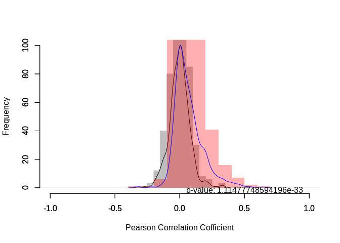
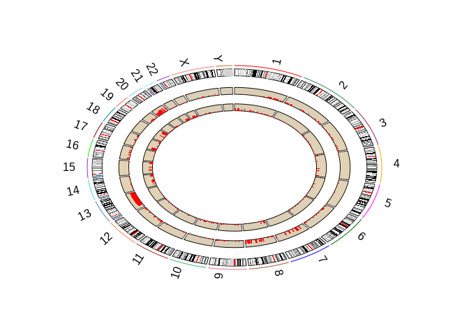
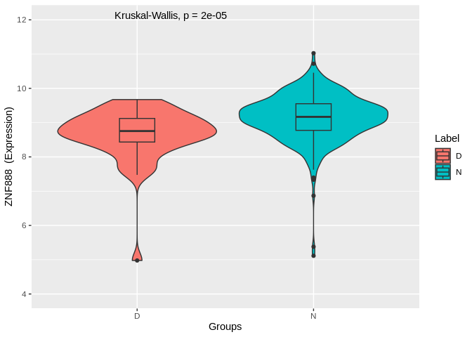
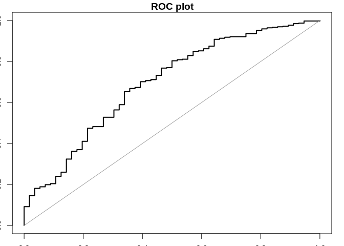
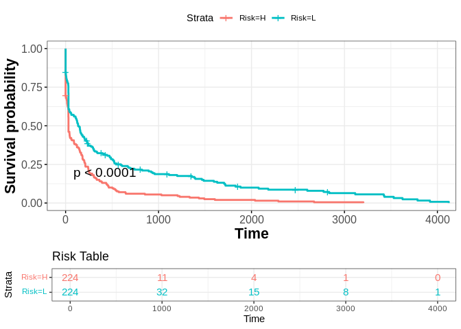
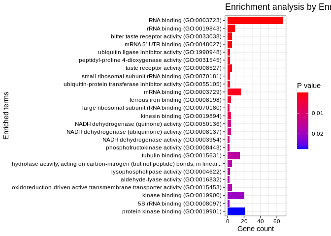
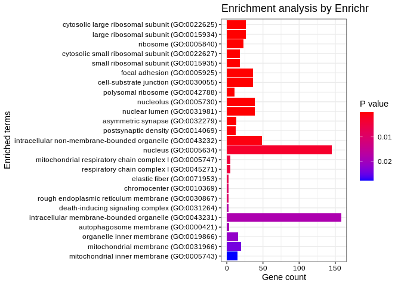
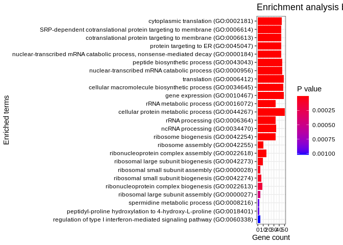
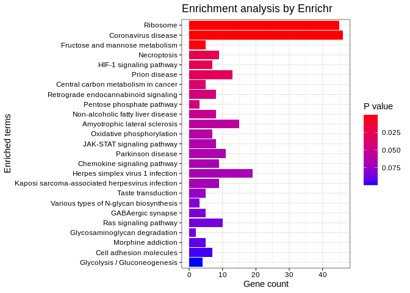

<!-- README.md is generated from README.Rmd. Please edit that file -->

# lncRNACNVIntegrateR

<!-- badges: start -->
<!-- badges: end -->

The goal of lncRNACNVIntegrateR is to uncover novel prognostic
biomarkers. By identifying key lncRNAs affected by CNV, it provides
valuable insights for personalized treatment strategies. The package
includes a risk score model to assist clinicians in decision-making,
potentially enhancing patient outcomes. Overall, lncRNACNVIntegrateR is
an invaluable tool for studying the associations between lncRNA and CNV
in cancer, offering insights into prognostic signatures.

## Installation

You can install the development version of lncRNACNVIntegrateR from
[GitHub](https://github.com/) using the following methods:

## 1. Using remotes or devtools
``` r
# Install the package from GitHub using remotes
install.packages("remotes")
remotes::install_github("tbgicgeb/lncRNACNVIntegrateR")

# Or using devtools
install.packages("devtools")
devtools::install_github("tbgicgeb/lncRNACNVIntegrateR")
```

## 2. Using pak
``` r
# install.packages("pak")
pak::pak("tyagineetu/lncRNACNVIntegrateR")
```
## 3. Using Docker

You can also run the package via its Docker container. Pull the Docker image using:

```sh
docker pull tbgicgeb/lncrnacnvintegrater_image
Then, start the container:
docker run -it tbgicgeb/lncrnacnvintegrater_image
```

## Example

This is a basic example which shows you how to solve a common problem:

``` r
library(lncRNACNVIntegrateR)
## basic example code
```

What is special about using `README.Rmd` instead of just `README.md`?
You can include R chunks like so:

You’ll still need to render `README.Rmd` regularly, to keep `README.md`
up-to-date. `devtools::build_readme()` is handy for this.

You can also embed plots, for example:

    #> here() starts at /DATA1/lncRNACNVIntegrateR
    #>                              TSPAN6 TNMD DPM1 SCYL3 C1orf112
    #> TCGA-CA-6718-01A-11R-1839-07   3078    1 2104   761      719
    #> TCGA-AD-6901-01A-11R-1928-07   3730  213 1899   438      197
    #> TCGA-AA-A00J-01A-02R-A002-07   1206    3  640   289      169
    #> TCGA-CM-4752-01A-01R-1410-07  10100   19 1793   233      187
    #> TCGA-AA-3549-01A-02R-0821-07   7003   41 1169   237      231
    #>                 ACAP3 ACTRT2 AGRN ANKRD65 ATAD3A
    #> TCGA-3L-AA1B-01     0      0    0       0      0
    #> TCGA-4N-A93T-01    -1     -1   -1      -1     -1
    #> TCGA-4T-AA8H-01     0      0    0       0      0
    #> TCGA-5M-AAT4-01    -1     -1   -1      -1     -1
    #> TCGA-5M-AAT5-01    -1     -1   -1      -1     -1
    #>                       bcr_patient_uuid bcr_patient_barcode form_completion_date
    #> 1                     bcr_patient_uuid bcr_patient_barcode form_completion_date
    #> 2                              CDE_ID:      CDE_ID:2003301              CDE_ID:
    #> 3 A94E1279-A975-480A-93E9-7B1FF05CBCBF        TCGA-3L-AA1B            2014-4-22
    #> 4 92554413-9EBC-4354-8E1B-9682F3A031D9        TCGA-4N-A93T            2014-10-1
    #> 5 A5E14ADD-1552-4606-9FFE-3A03BCF76640        TCGA-4T-AA8H             2014-6-5
    #>            histologic_diagnosis                  prospective_collection
    #> 1             histological_type tissue_prospective_collection_indicator
    #> 2                CDE_ID:3081934                          CDE_ID:3088492
    #> 3          Colon Adenocarcinoma                                     YES
    #> 4          Colon Adenocarcinoma                                     YES
    #> 5 Colon Mucinous Adenocarcinoma                                      NO
    #> Loading required package: S4Vectors
    #> Loading required package: stats4
    #> Loading required package: BiocGenerics
    #> 
    #> Attaching package: 'BiocGenerics'
    #> The following objects are masked from 'package:stats':
    #> 
    #>     IQR, mad, sd, var, xtabs
    #> The following objects are masked from 'package:base':
    #> 
    #>     anyDuplicated, append, as.data.frame, basename, cbind, colnames,
    #>     dirname, do.call, duplicated, eval, evalq, Filter, Find, get, grep,
    #>     grepl, intersect, is.unsorted, lapply, Map, mapply, match, mget,
    #>     order, paste, pmax, pmax.int, pmin, pmin.int, Position, rank,
    #>     rbind, Reduce, rownames, sapply, setdiff, sort, table, tapply,
    #>     union, unique, unsplit, which.max, which.min
    #> 
    #> Attaching package: 'S4Vectors'
    #> The following objects are masked from 'package:base':
    #> 
    #>     expand.grid, I, unname
    #> Loading required package: IRanges
    #> Loading required package: GenomicRanges
    #> Loading required package: GenomeInfoDb
    #> Loading required package: SummarizedExperiment
    #> Loading required package: MatrixGenerics
    #> Loading required package: matrixStats
    #> 
    #> Attaching package: 'MatrixGenerics'
    #> The following objects are masked from 'package:matrixStats':
    #> 
    #>     colAlls, colAnyNAs, colAnys, colAvgsPerRowSet, colCollapse,
    #>     colCounts, colCummaxs, colCummins, colCumprods, colCumsums,
    #>     colDiffs, colIQRDiffs, colIQRs, colLogSumExps, colMadDiffs,
    #>     colMads, colMaxs, colMeans2, colMedians, colMins, colOrderStats,
    #>     colProds, colQuantiles, colRanges, colRanks, colSdDiffs, colSds,
    #>     colSums2, colTabulates, colVarDiffs, colVars, colWeightedMads,
    #>     colWeightedMeans, colWeightedMedians, colWeightedSds,
    #>     colWeightedVars, rowAlls, rowAnyNAs, rowAnys, rowAvgsPerColSet,
    #>     rowCollapse, rowCounts, rowCummaxs, rowCummins, rowCumprods,
    #>     rowCumsums, rowDiffs, rowIQRDiffs, rowIQRs, rowLogSumExps,
    #>     rowMadDiffs, rowMads, rowMaxs, rowMeans2, rowMedians, rowMins,
    #>     rowOrderStats, rowProds, rowQuantiles, rowRanges, rowRanks,
    #>     rowSdDiffs, rowSds, rowSums2, rowTabulates, rowVarDiffs, rowVars,
    #>     rowWeightedMads, rowWeightedMeans, rowWeightedMedians,
    #>     rowWeightedSds, rowWeightedVars
    #> Loading required package: Biobase
    #> Welcome to Bioconductor
    #> 
    #>     Vignettes contain introductory material; view with
    #>     'browseVignettes()'. To cite Bioconductor, see
    #>     'citation("Biobase")', and for packages 'citation("pkgname")'.
    #> 
    #> Attaching package: 'Biobase'
    #> The following object is masked from 'package:MatrixGenerics':
    #> 
    #>     rowMedians
    #> The following objects are masked from 'package:matrixStats':
    #> 
    #>     anyMissing, rowMedians
    #> 
    #> Attaching package: 'dplyr'
    #> The following object is masked from 'package:Biobase':
    #> 
    #>     combine
    #> The following object is masked from 'package:matrixStats':
    #> 
    #>     count
    #> The following objects are masked from 'package:GenomicRanges':
    #> 
    #>     intersect, setdiff, union
    #> The following object is masked from 'package:GenomeInfoDb':
    #> 
    #>     intersect
    #> The following objects are masked from 'package:IRanges':
    #> 
    #>     collapse, desc, intersect, setdiff, slice, union
    #> The following objects are masked from 'package:S4Vectors':
    #> 
    #>     first, intersect, rename, setdiff, setequal, union
    #> The following objects are masked from 'package:BiocGenerics':
    #> 
    #>     combine, intersect, setdiff, union
    #> The following objects are masked from 'package:stats':
    #> 
    #>     filter, lag
    #> The following objects are masked from 'package:base':
    #> 
    #>     intersect, setdiff, setequal, union
    #> Warning in DESeq2::DESeq(dds): the design is ~ 1 (just an intercept). is this
    #> intended?
    #> estimating size factors
    #> estimating dispersions
    #> gene-wise dispersion estimates
    #> mean-dispersion relationship
    #> final dispersion estimates
    #> fitting model and testing
    #> -- replacing outliers and refitting for 9818 genes
    #> -- DESeq argument 'minReplicatesForReplace' = 7 
    #> -- original counts are preserved in counts(dds)
    #> estimating dispersions
    #> fitting model and testing
    #> Downloaded GTF file successfully.
    #> Warning in rbind(...): number of columns of result is not a multiple of vector
    #> length (arg 1)
    #>                  GAS5 MIR205HG LINC00692 LINC00955    DANCR
    #> TCGA-3L-AA1B 12.99340 4.244939  2.617266  3.401638 10.57960
    #> TCGA-4N-A93T 12.51295 3.099276  2.617266  3.444635 10.24113
    #> TCGA-4T-AA8H 12.17270 2.617266  2.617266  2.617266 10.64304
    #> TCGA-5M-AAT4 13.34098 3.393956  2.617266  3.510638 10.22078
    #> TCGA-5M-AAT6 12.54132 8.302659  2.617266  2.617266 10.48174
    #>              GAS5 MIR205HG LINC00692 LINC00955 DANCR
    #> TCGA-3L-AA1B    0        0         0         1     1
    #> TCGA-4N-A93T    0        0         0        -1    -1
    #> TCGA-4T-AA8H    0        1         1         0     0
    #> TCGA-5M-AAT4    0        0        -1        -1    -1
    #> TCGA-5M-AAT6    0        0         0         0     0
    #>              vital_status days_to_last_followup
    #> TCGA-3L-AA1B        Alive                   154
    #> TCGA-4N-A93T        Alive                     8
    #> TCGA-4T-AA8H        Alive                   160
    #> TCGA-5M-AAT4         Dead       [Not Available]
    #> TCGA-5M-AAT6         Dead       [Not Available]
    #> TCGA-5M-AATE        Alive                  1200
    #>                 OR4F5   OR4F29   OR4F16   SAMD11    NOC2L
    #> TCGA-3L-AA1B 2.617266 2.617266 2.617266 7.112707 11.48086
    #> TCGA-4N-A93T 2.617266 2.617266 2.617266 4.818667 11.18282
    #> TCGA-4T-AA8H 2.617266 2.617266 2.617266 4.509899 11.87434
    #> TCGA-5M-AAT4 2.617266 2.617266 2.617266 5.637257 11.89901
    #> TCGA-5M-AAT6 2.617266 2.617266 2.617266 6.433041 12.34630
    #> Loading required package: usethis
    #> Warning in cor(as.numeric(df2_subset[i, ]), as.numeric(df1_sorted[i, ])): the
    #> standard deviation is zero
    #> Warning in cor(as.numeric(df2_subset[i, ]), as.numeric(df1_sorted[i, ])): the
    #> standard deviation is zero
    #> Warning in cor(as.numeric(df2_subset[i, ]), as.numeric(df1_sorted[i, ])): the
    #> standard deviation is zero
    #> Warning in cor(as.numeric(df2_subset[i, ]), as.numeric(df1_sorted[i, ])): the
    #> standard deviation is zero
    #> Warning in cor(as.numeric(df2_subset[i, ]), as.numeric(df1_sorted[i, ])): the
    #> standard deviation is zero
    #> Warning in cor(as.numeric(df2_subset[i, ]), as.numeric(df1_sorted[i, ])): the
    #> standard deviation is zero
    #> Warning in cor(as.numeric(df2_subset[i, ]), as.numeric(df1_sorted[i, ])): the
    #> standard deviation is zero
    #> Warning in cor(as.numeric(df2_subset[i, ]), as.numeric(df1_sorted[i, ])): the
    #> standard deviation is zero
    #> Warning in cor(as.numeric(df2_subset[i, ]), as.numeric(df1_sorted[i, ])): the
    #> standard deviation is zero
    #> Warning in cor(as.numeric(df2_subset[i, ]), as.numeric(df1_sorted[i, ])): the
    #> standard deviation is zero
    #> Warning in cor(as.numeric(df2_subset[i, ]), as.numeric(df1_sorted[i, ])): the
    #> standard deviation is zero
    #> Warning in cor(as.numeric(df2_subset[i, ]), as.numeric(df1_sorted[i, ])): the
    #> standard deviation is zero
    #> Warning in cor(as.numeric(df2_subset[i, ]), as.numeric(df1_sorted[i, ])): the
    #> standard deviation is zero
    #> Warning in cor(as.numeric(df2_subset[i, ]), as.numeric(df1_sorted[i, ])): the
    #> standard deviation is zero
    #> Warning in cor(as.numeric(df2_subset[rand.cnv.inds, ][i, ]),
    #> as.numeric(df1_sorted[rand.lnc.inds, : the standard deviation is zero
    #> Warning in cor(as.numeric(df2_subset[rand.cnv.inds, ][i, ]),
    #> as.numeric(df1_sorted[rand.lnc.inds, : the standard deviation is zero
    #> Warning in cor(as.numeric(df2_subset[rand.cnv.inds, ][i, ]),
    #> as.numeric(df1_sorted[rand.lnc.inds, : the standard deviation is zero
    #> Warning in cor(as.numeric(df2_subset[rand.cnv.inds, ][i, ]),
    #> as.numeric(df1_sorted[rand.lnc.inds, : the standard deviation is zero
    #> Warning in cor(as.numeric(df2_subset[rand.cnv.inds, ][i, ]),
    #> as.numeric(df1_sorted[rand.lnc.inds, : the standard deviation is zero
    #> Warning in cor(as.numeric(df2_subset[rand.cnv.inds, ][i, ]),
    #> as.numeric(df1_sorted[rand.lnc.inds, : the standard deviation is zero
    #> Warning in cor(as.numeric(df2_subset[rand.cnv.inds, ][i, ]),
    #> as.numeric(df1_sorted[rand.lnc.inds, : the standard deviation is zero
    #> Warning in cor(as.numeric(df2_subset[rand.cnv.inds, ][i, ]),
    #> as.numeric(df1_sorted[rand.lnc.inds, : the standard deviation is zero
    #> Warning in cor(as.numeric(df2_subset[rand.cnv.inds, ][i, ]),
    #> as.numeric(df1_sorted[rand.lnc.inds, : the standard deviation is zero
    #> Warning in cor(as.numeric(df2_subset[rand.cnv.inds, ][i, ]),
    #> as.numeric(df1_sorted[rand.lnc.inds, : the standard deviation is zero
    #> Warning in cor(as.numeric(df2_subset[rand.cnv.inds, ][i, ]),
    #> as.numeric(df1_sorted[rand.lnc.inds, : the standard deviation is zero
    #> Warning in cor(as.numeric(df2_subset[rand.cnv.inds, ][i, ]),
    #> as.numeric(df1_sorted[rand.lnc.inds, : the standard deviation is zero
    #> Warning in cor(as.numeric(df2_subset[rand.cnv.inds, ][i, ]),
    #> as.numeric(df1_sorted[rand.lnc.inds, : the standard deviation is zero
    #> Warning in cor(as.numeric(df2_subset[rand.cnv.inds, ][i, ]),
    #> as.numeric(df1_sorted[rand.lnc.inds, : the standard deviation is zero
    #> Warning in mtext(text = "Random", side = 3, xjust = 0.2, yjust = 0.5, line =
    #> 20): "xjust" is not a graphical parameter
    #> Warning in mtext(text = "Random", side = 3, xjust = 0.2, yjust = 0.5, line =
    #> 20): "yjust" is not a graphical parameter
    #> Warning in mtext(text = "LncRNA-CNV", side = 2, xjust = 0.6, yjust = 0.5, :
    #> "xjust" is not a graphical parameter
    #> Warning in mtext(text = "LncRNA-CNV", side = 2, xjust = 0.6, yjust = 0.5, :
    #> "yjust" is not a graphical parameter
    #> Warning in text.default(x = 0.5, y = -0.1, labels = paste("p-value:", p_value),
    #> : "hjust" is not a graphical parameter
    #> 
    #> RCircos.Core.Components initialized.
    #> Type ?RCircos.Reset.Plot.Parameters to see how to modify the core components.



    #> Warning in if (side == "in") {: the condition has length > 1 and only the first
    #> element will be used



    #>           TCGA-3L-AA1B TCGA-4N-A93T TCGA-4T-AA8H TCGA-5M-AAT4 TCGA-5M-AAT6
    #> SNHG11         9.13073     9.545129     7.958639     8.815767     8.125889
    #> SPATA13       11.01411    11.494530    11.354615    10.508671     9.925927
    #> LINC00909      7.77512     7.800594     6.910837     7.439476     7.483442
    #> LINC00525      6.16692     5.116492     3.939955     5.740592     4.102859
    #> LINC00589      4.97841     3.099276     4.583212     3.510638     3.162763
    #>           TCGA.3L.AA1B TCGA.4N.A93T TCGA.4T.AA8H TCGA.5M.AAT4 TCGA.5M.AAT6
    #> SNHG11               1            1            0            1            0
    #> SPATA13              1            1            1            0            1
    #> LINC00909           -1           -1           -1           -2            0
    #> LINC00525            1            1            1            1            0
    #> LINC00589            1           -1            1           -1           -1
    #> Warning in extract_survival_related_significant_lncRNA(final_expression_data, :
    #> NAs introduced by coercion
    #> Loading required package: doParallel
    #> Loading required package: foreach
    #> Loading required package: iterators
    #> Loading required package: parallel
    #> Loading required package: data.table
    #> 
    #> Attaching package: 'data.table'
    #> The following objects are masked from 'package:dplyr':
    #> 
    #>     between, first, last
    #> The following object is masked from 'package:SummarizedExperiment':
    #> 
    #>     shift
    #> The following object is masked from 'package:GenomicRanges':
    #> 
    #>     shift
    #> The following object is masked from 'package:IRanges':
    #> 
    #>     shift
    #> The following objects are masked from 'package:S4Vectors':
    #> 
    #>     first, second
    #> Loading required package: stringr
    #> Loading required package: survival
    #> Loading required package: arm
    #> Loading required package: MASS
    #> 
    #> Attaching package: 'MASS'
    #> The following object is masked from 'package:dplyr':
    #> 
    #>     select
    #> Loading required package: Matrix
    #> 
    #> Attaching package: 'Matrix'
    #> The following object is masked from 'package:S4Vectors':
    #> 
    #>     expand
    #> Loading required package: lme4
    #> 
    #> arm (Version 1.14-4, built: 2024-4-1)
    #> Working directory is /DATA1/lncRNACNVIntegrateR
    #> 
    #> ##############################
    #> #RegParallel
    #> ##############################
    #> System is:
    #> -- Linux
    #> Blocksize:
    #> -- 30
    #> Cores / Threads:
    #> -- 2
    #> Terms included in model:
    #> -- days_to_last_followup
    #> -- vital_status
    #> First 5 formulae:
    #> -- Surv(days_to_last_followup, vital_status) ~ SNHG11
    #> -- Surv(days_to_last_followup, vital_status) ~ SPATA13
    #> -- Surv(days_to_last_followup, vital_status) ~ LINC00909
    #> -- Surv(days_to_last_followup, vital_status) ~ LINC00525
    #> -- Surv(days_to_last_followup, vital_status) ~ LINC00589
    #> Done!
    #>           TCGA-3L-AA1B TCGA-4N-A93T TCGA-4T-AA8H TCGA-5M-AAT4 TCGA-5M-AAT6
    #> BCYRN1        4.644892     3.859729     3.470909     3.393956     3.162763
    #> BMS1P4        4.296453     4.084551     4.952351     4.664547     3.810049
    #> C10orf95      3.519406     3.444635     3.808093     3.069272     3.551332
    #> C11orf72      3.073814     3.295833     3.225218     3.393956     3.551332
    #> C14orf132     8.239006     5.283839     6.017245     5.867522     7.897747
    #>           TCGA.3L.AA1B TCGA.4N.A93T TCGA.4T.AA8H TCGA.5M.AAT4 TCGA.5M.AAT6
    #> LINC00963            0            0            0            0            0
    #> SNHG15               1            1            1            1            0
    #> LINC00265            1            1            1            1            0
    #> HCG18                0            0            0            0            0
    #> LINC00324           -1           -1            1           -1            0
    #>                SNHG11   SPATA13 LINC00909 LINC00525 LINC00589
    #> TCGA-3L-AA1B 9.130730 11.014110  7.775120  6.166920  4.978410
    #> TCGA-4N-A93T 9.545129 11.494530  7.800594  5.116492  3.099276
    #> TCGA-4T-AA8H 7.958639 11.354615  6.910837  3.939955  4.583212
    #> TCGA-5M-AAT4 8.815767 10.508671  7.439476  5.740592  3.510638
    #> TCGA-5M-AAT6 8.125889  9.925927  7.483442  4.102859  3.162763
    #>     Variable      Term       Beta StandardError         Z            P
    #>       <char>    <char>      <num>         <num>     <num>        <num>
    #> 1: LINC00963 LINC00963  0.2258333    0.09359035  2.412997 0.0158219313
    #> 2:    SNHG15    SNHG15 -0.1744907    0.07768929 -2.246007 0.0247035341
    #> 3: LINC00265 LINC00265 -0.1809466    0.05926779 -3.053034 0.0022654001
    #> 4:     HCG18     HCG18 -0.3108578    0.09087031 -3.420895 0.0006241536
    #> 5: LINC00324 LINC00324  0.1534345    0.06481009  2.367448 0.0179112352
    #> 6:   MIR17HG   MIR17HG -0.1280990    0.04439897 -2.885180 0.0039119025
    #>             LRT         Wald      LogRank        HR
    #>           <num>        <num>        <num>     <num>
    #> 1: 0.0157735616 0.0158219313 0.0158104217 1.2533667
    #> 2: 0.0248433297 0.0247035341 0.0248471873 0.8398846
    #> 3: 0.0023934461 0.0022654001 0.0022601857 0.8344799
    #> 4: 0.0003466775 0.0006241536 0.0006855467 0.7328181
    #> 5: 0.0184960732 0.0179112352 0.0178746096 1.1658315
    #> 6: 0.0035669770 0.0039119025 0.0040012832 0.8797663
    #> 
    #> Attaching package: 'purrr'
    #> The following object is masked from 'package:data.table':
    #> 
    #>     transpose
    #> The following objects are masked from 'package:foreach':
    #> 
    #>     accumulate, when
    #> The following object is masked from 'package:GenomicRanges':
    #> 
    #>     reduce
    #> The following object is masked from 'package:IRanges':
    #> 
    #>     reduce
    #> Saved expression for LINC00963 to lncRNA_expression_files/LINC00963_expression.txt 
    #> Saved expression for SNHG15 to lncRNA_expression_files/SNHG15_expression.txt 
    #> Saved expression for LINC00265 to lncRNA_expression_files/LINC00265_expression.txt 
    #> Saved expression for HCG18 to lncRNA_expression_files/HCG18_expression.txt 
    #> Saved expression for LINC00324 to lncRNA_expression_files/LINC00324_expression.txt 
    #> Saved expression for MIR17HG to lncRNA_expression_files/MIR17HG_expression.txt 
    #> Saved expression for SNHG7 to lncRNA_expression_files/SNHG7_expression.txt 
    #> Saved expression for GAS5 to lncRNA_expression_files/GAS5_expression.txt 
    #> Saved expression for LINC00680 to lncRNA_expression_files/LINC00680_expression.txt 
    #> Saved expression for MIR22HG to lncRNA_expression_files/MIR22HG_expression.txt 
    #> Saved expression for DLEU2 to lncRNA_expression_files/DLEU2_expression.txt 
    #> Saved expression for LINC00566 to lncRNA_expression_files/LINC00566_expression.txt 
    #> Saved expression for ZNF888 to lncRNA_expression_files/ZNF888_expression.txt 
    #> Saved expression for TUG1 to lncRNA_expression_files/TUG1_expression.txt 
    #> Saved expression for CASC2 to lncRNA_expression_files/CASC2_expression.txt 
    #> Saved expression for CYB561D2 to lncRNA_expression_files/CYB561D2_expression.txt 
    #> Saved expression for LINC00852 to lncRNA_expression_files/LINC00852_expression.txt 
    #> Saved expression for C9orf147 to lncRNA_expression_files/C9orf147_expression.txt 
    #> Saved expression for LINC00184 to lncRNA_expression_files/LINC00184_expression.txt 
    #> Saved expression for FAM85B to lncRNA_expression_files/FAM85B_expression.txt 
    #> Saved expression for LINC00271 to lncRNA_expression_files/LINC00271_expression.txt 
    #> Saved expression for C9orf139 to lncRNA_expression_files/C9orf139_expression.txt 
    #> Saved expression for RNU6ATAC35P to lncRNA_expression_files/RNU6ATAC35P_expression.txt 
    #> Saved expression for BCYRN1 to lncRNA_expression_files/BCYRN1_expression.txt 
    #> Saved expression for BMS1P4 to lncRNA_expression_files/BMS1P4_expression.txt 
    #> Saved expression for MTHFS to lncRNA_expression_files/MTHFS_expression.txt 
    #> Saved expression for LINC00662 to lncRNA_expression_files/LINC00662_expression.txt 
    #> Saved expression for LINC00871 to lncRNA_expression_files/LINC00871_expression.txt 
    #> Saved expression for LINC00881 to lncRNA_expression_files/LINC00881_expression.txt 
    #> Saved expression for LINC00641 to lncRNA_expression_files/LINC00641_expression.txt 
    #> Saved expression for LINC00115 to lncRNA_expression_files/LINC00115_expression.txt 
    #> Saved expression for CASC9 to lncRNA_expression_files/CASC9_expression.txt 
    #> Saved expression for LINC00847 to lncRNA_expression_files/LINC00847_expression.txt 
    #> Saved expression for C10orf95 to lncRNA_expression_files/C10orf95_expression.txt 
    #> Saved expression for C1orf229 to lncRNA_expression_files/C1orf229_expression.txt 
    #> Saved expression for LINC00867 to lncRNA_expression_files/LINC00867_expression.txt 
    #> Saved expression for MIR210HG to lncRNA_expression_files/MIR210HG_expression.txt 
    #> Saved expression for FAM215B to lncRNA_expression_files/FAM215B_expression.txt 
    #> Saved expression for MIAT to lncRNA_expression_files/MIAT_expression.txt 
    #> Saved expression for HCG9 to lncRNA_expression_files/HCG9_expression.txt 
    #> Saved expression for PCAT6 to lncRNA_expression_files/PCAT6_expression.txt 
    #> Saved expression for LINC00032 to lncRNA_expression_files/LINC00032_expression.txt 
    #> Saved expression for MIR181A2HG to lncRNA_expression_files/MIR181A2HG_expression.txt 
    #> Saved expression for LINC00342 to lncRNA_expression_files/LINC00342_expression.txt 
    #> Saved expression for LINC00970 to lncRNA_expression_files/LINC00970_expression.txt 
    #> Saved expression for FENDRR to lncRNA_expression_files/FENDRR_expression.txt 
    #> Saved expression for LINC00907 to lncRNA_expression_files/LINC00907_expression.txt 
    #> Saved expression for POLR2J4 to lncRNA_expression_files/POLR2J4_expression.txt 
    #> Saved expression for LINC00354 to lncRNA_expression_files/LINC00354_expression.txt 
    #> Saved expression for C3orf35 to lncRNA_expression_files/C3orf35_expression.txt 
    #> Saved expression for LINC00862 to lncRNA_expression_files/LINC00862_expression.txt 
    #> Saved expression for DLEU2L to lncRNA_expression_files/DLEU2L_expression.txt 
    #> Saved expression for LINC00240 to lncRNA_expression_files/LINC00240_expression.txt 
    #> Saved expression for FAM66E to lncRNA_expression_files/FAM66E_expression.txt 
    #> Saved expression for C14orf132 to lncRNA_expression_files/C14orf132_expression.txt 
    #> Saved expression for LINC00313 to lncRNA_expression_files/LINC00313_expression.txt 
    #> Saved expression for LINC00960 to lncRNA_expression_files/LINC00960_expression.txt 
    #> Saved expression for SCGB1B2P to lncRNA_expression_files/SCGB1B2P_expression.txt 
    #> Saved expression for LINC00404 to lncRNA_expression_files/LINC00404_expression.txt 
    #> Saved expression for TINCR to lncRNA_expression_files/TINCR_expression.txt 
    #> Saved expression for C11orf72 to lncRNA_expression_files/C11orf72_expression.txt 
    #> Saved expression for LINC00892 to lncRNA_expression_files/LINC00892_expression.txt 
    #> Saved expression for LINC00618 to lncRNA_expression_files/LINC00618_expression.txt 
    #> Saved expression for FAM95B1 to lncRNA_expression_files/FAM95B1_expression.txt 
    #> Saved expression for LINC00858 to lncRNA_expression_files/LINC00858_expression.txt 
    #> Saved expression for LINC00486 to lncRNA_expression_files/LINC00486_expression.txt 
    #> Saved expression for LINC00900 to lncRNA_expression_files/LINC00900_expression.txt 
    #> Saved expression for PGM5P2 to lncRNA_expression_files/PGM5P2_expression.txt 
    #> Saved expression for LINC00877 to lncRNA_expression_files/LINC00877_expression.txt 
    #> Saved expression for LINC00592 to lncRNA_expression_files/LINC00592_expression.txt 
    #> Saved expression for LINC00987 to lncRNA_expression_files/LINC00987_expression.txt 
    #> Saved expression for CXADRP3 to lncRNA_expression_files/CXADRP3_expression.txt 
    #> Saved expression for LINC00624 to lncRNA_expression_files/LINC00624_expression.txt 
    #> Text files have been created and saved in the directory: lncRNA_files 
    #> Saved category data for LINC00963 ( normal ) to lncRNA_category_data/LINC00963_normal_data.txt 
    #> Saved category data for LINC00963 ( amplification ) to lncRNA_category_data/LINC00963_amplification_data.txt 
    #> Saved category data for LINC00963 ( deletion ) to lncRNA_category_data/LINC00963_deletion_data.txt 
    #> Saved category data for SNHG15 ( normal ) to lncRNA_category_data/SNHG15_normal_data.txt 
    #> Saved category data for SNHG15 ( amplification ) to lncRNA_category_data/SNHG15_amplification_data.txt 
    #> Saved category data for SNHG15 ( deletion ) to lncRNA_category_data/SNHG15_deletion_data.txt 
    #> Saved category data for LINC00265 ( normal ) to lncRNA_category_data/LINC00265_normal_data.txt 
    #> Saved category data for LINC00265 ( amplification ) to lncRNA_category_data/LINC00265_amplification_data.txt 
    #> Saved category data for LINC00265 ( deletion ) to lncRNA_category_data/LINC00265_deletion_data.txt 
    #> Saved category data for HCG18 ( normal ) to lncRNA_category_data/HCG18_normal_data.txt 
    #> Saved category data for HCG18 ( amplification ) to lncRNA_category_data/HCG18_amplification_data.txt 
    #> Saved category data for HCG18 ( deletion ) to lncRNA_category_data/HCG18_deletion_data.txt 
    #> Saved category data for LINC00324 ( normal ) to lncRNA_category_data/LINC00324_normal_data.txt 
    #> Saved category data for LINC00324 ( amplification ) to lncRNA_category_data/LINC00324_amplification_data.txt 
    #> Saved category data for LINC00324 ( deletion ) to lncRNA_category_data/LINC00324_deletion_data.txt 
    #> Saved category data for MIR17HG ( normal ) to lncRNA_category_data/MIR17HG_normal_data.txt 
    #> Saved category data for MIR17HG ( amplification ) to lncRNA_category_data/MIR17HG_amplification_data.txt 
    #> Saved category data for MIR17HG ( deletion ) to lncRNA_category_data/MIR17HG_deletion_data.txt 
    #> Saved category data for SNHG7 ( normal ) to lncRNA_category_data/SNHG7_normal_data.txt 
    #> Saved category data for SNHG7 ( amplification ) to lncRNA_category_data/SNHG7_amplification_data.txt 
    #> Saved category data for SNHG7 ( deletion ) to lncRNA_category_data/SNHG7_deletion_data.txt 
    #> Saved category data for GAS5 ( normal ) to lncRNA_category_data/GAS5_normal_data.txt 
    #> Saved category data for GAS5 ( amplification ) to lncRNA_category_data/GAS5_amplification_data.txt 
    #> Saved category data for GAS5 ( deletion ) to lncRNA_category_data/GAS5_deletion_data.txt 
    #> Saved category data for LINC00680 ( normal ) to lncRNA_category_data/LINC00680_normal_data.txt 
    #> Saved category data for LINC00680 ( amplification ) to lncRNA_category_data/LINC00680_amplification_data.txt 
    #> Saved category data for LINC00680 ( deletion ) to lncRNA_category_data/LINC00680_deletion_data.txt 
    #> Saved category data for MIR22HG ( normal ) to lncRNA_category_data/MIR22HG_normal_data.txt 
    #> Saved category data for MIR22HG ( amplification ) to lncRNA_category_data/MIR22HG_amplification_data.txt 
    #> Saved category data for MIR22HG ( deletion ) to lncRNA_category_data/MIR22HG_deletion_data.txt 
    #> Saved category data for DLEU2 ( normal ) to lncRNA_category_data/DLEU2_normal_data.txt 
    #> Saved category data for DLEU2 ( amplification ) to lncRNA_category_data/DLEU2_amplification_data.txt 
    #> Saved category data for DLEU2 ( deletion ) to lncRNA_category_data/DLEU2_deletion_data.txt 
    #> Saved category data for LINC00566 ( normal ) to lncRNA_category_data/LINC00566_normal_data.txt 
    #> Saved category data for LINC00566 ( amplification ) to lncRNA_category_data/LINC00566_amplification_data.txt 
    #> Saved category data for LINC00566 ( deletion ) to lncRNA_category_data/LINC00566_deletion_data.txt 
    #> Saved category data for ZNF888 ( normal ) to lncRNA_category_data/ZNF888_normal_data.txt 
    #> Saved category data for ZNF888 ( amplification ) to lncRNA_category_data/ZNF888_amplification_data.txt 
    #> Saved category data for ZNF888 ( deletion ) to lncRNA_category_data/ZNF888_deletion_data.txt 
    #> Saved category data for TUG1 ( normal ) to lncRNA_category_data/TUG1_normal_data.txt 
    #> Saved category data for TUG1 ( amplification ) to lncRNA_category_data/TUG1_amplification_data.txt 
    #> Saved category data for TUG1 ( deletion ) to lncRNA_category_data/TUG1_deletion_data.txt 
    #> Saved category data for CASC2 ( normal ) to lncRNA_category_data/CASC2_normal_data.txt 
    #> Saved category data for CASC2 ( amplification ) to lncRNA_category_data/CASC2_amplification_data.txt 
    #> Saved category data for CASC2 ( deletion ) to lncRNA_category_data/CASC2_deletion_data.txt 
    #> Saved category data for CYB561D2 ( normal ) to lncRNA_category_data/CYB561D2_normal_data.txt 
    #> Saved category data for CYB561D2 ( amplification ) to lncRNA_category_data/CYB561D2_amplification_data.txt 
    #> Saved category data for CYB561D2 ( deletion ) to lncRNA_category_data/CYB561D2_deletion_data.txt 
    #> Saved category data for LINC00852 ( normal ) to lncRNA_category_data/LINC00852_normal_data.txt 
    #> Saved category data for LINC00852 ( amplification ) to lncRNA_category_data/LINC00852_amplification_data.txt 
    #> Saved category data for LINC00852 ( deletion ) to lncRNA_category_data/LINC00852_deletion_data.txt 
    #> Saved category data for C9orf147 ( normal ) to lncRNA_category_data/C9orf147_normal_data.txt 
    #> Saved category data for C9orf147 ( amplification ) to lncRNA_category_data/C9orf147_amplification_data.txt 
    #> Saved category data for C9orf147 ( deletion ) to lncRNA_category_data/C9orf147_deletion_data.txt 
    #> Saved category data for LINC00184 ( normal ) to lncRNA_category_data/LINC00184_normal_data.txt 
    #> Saved category data for LINC00184 ( amplification ) to lncRNA_category_data/LINC00184_amplification_data.txt 
    #> Saved category data for LINC00184 ( deletion ) to lncRNA_category_data/LINC00184_deletion_data.txt 
    #> Saved category data for FAM85B ( normal ) to lncRNA_category_data/FAM85B_normal_data.txt 
    #> Saved category data for FAM85B ( amplification ) to lncRNA_category_data/FAM85B_amplification_data.txt 
    #> Saved category data for FAM85B ( deletion ) to lncRNA_category_data/FAM85B_deletion_data.txt 
    #> Saved category data for LINC00271 ( normal ) to lncRNA_category_data/LINC00271_normal_data.txt 
    #> Saved category data for LINC00271 ( amplification ) to lncRNA_category_data/LINC00271_amplification_data.txt 
    #> Saved category data for LINC00271 ( deletion ) to lncRNA_category_data/LINC00271_deletion_data.txt 
    #> Saved category data for C9orf139 ( normal ) to lncRNA_category_data/C9orf139_normal_data.txt 
    #> Saved category data for C9orf139 ( amplification ) to lncRNA_category_data/C9orf139_amplification_data.txt 
    #> Saved category data for C9orf139 ( deletion ) to lncRNA_category_data/C9orf139_deletion_data.txt 
    #> Saved category data for RNU6ATAC35P ( normal ) to lncRNA_category_data/RNU6ATAC35P_normal_data.txt 
    #> Saved category data for RNU6ATAC35P ( amplification ) to lncRNA_category_data/RNU6ATAC35P_amplification_data.txt 
    #> Saved category data for RNU6ATAC35P ( deletion ) to lncRNA_category_data/RNU6ATAC35P_deletion_data.txt 
    #> Saved category data for BCYRN1 ( normal ) to lncRNA_category_data/BCYRN1_normal_data.txt 
    #> Saved category data for BCYRN1 ( amplification ) to lncRNA_category_data/BCYRN1_amplification_data.txt 
    #> Saved category data for BCYRN1 ( deletion ) to lncRNA_category_data/BCYRN1_deletion_data.txt 
    #> Saved category data for BMS1P4 ( normal ) to lncRNA_category_data/BMS1P4_normal_data.txt 
    #> Saved category data for BMS1P4 ( amplification ) to lncRNA_category_data/BMS1P4_amplification_data.txt 
    #> Saved category data for BMS1P4 ( deletion ) to lncRNA_category_data/BMS1P4_deletion_data.txt 
    #> Saved category data for MTHFS ( normal ) to lncRNA_category_data/MTHFS_normal_data.txt 
    #> Saved category data for MTHFS ( amplification ) to lncRNA_category_data/MTHFS_amplification_data.txt 
    #> Saved category data for MTHFS ( deletion ) to lncRNA_category_data/MTHFS_deletion_data.txt 
    #> Saved category data for LINC00662 ( normal ) to lncRNA_category_data/LINC00662_normal_data.txt 
    #> Saved category data for LINC00662 ( amplification ) to lncRNA_category_data/LINC00662_amplification_data.txt 
    #> Saved category data for LINC00662 ( deletion ) to lncRNA_category_data/LINC00662_deletion_data.txt 
    #> Saved category data for LINC00871 ( normal ) to lncRNA_category_data/LINC00871_normal_data.txt 
    #> Saved category data for LINC00871 ( amplification ) to lncRNA_category_data/LINC00871_amplification_data.txt 
    #> Saved category data for LINC00871 ( deletion ) to lncRNA_category_data/LINC00871_deletion_data.txt 
    #> Saved category data for LINC00881 ( normal ) to lncRNA_category_data/LINC00881_normal_data.txt 
    #> Saved category data for LINC00881 ( amplification ) to lncRNA_category_data/LINC00881_amplification_data.txt 
    #> Saved category data for LINC00881 ( deletion ) to lncRNA_category_data/LINC00881_deletion_data.txt 
    #> Saved category data for LINC00641 ( normal ) to lncRNA_category_data/LINC00641_normal_data.txt 
    #> Saved category data for LINC00641 ( amplification ) to lncRNA_category_data/LINC00641_amplification_data.txt 
    #> Saved category data for LINC00641 ( deletion ) to lncRNA_category_data/LINC00641_deletion_data.txt 
    #> Saved category data for LINC00115 ( normal ) to lncRNA_category_data/LINC00115_normal_data.txt 
    #> Saved category data for LINC00115 ( amplification ) to lncRNA_category_data/LINC00115_amplification_data.txt 
    #> Saved category data for LINC00115 ( deletion ) to lncRNA_category_data/LINC00115_deletion_data.txt 
    #> Saved category data for CASC9 ( normal ) to lncRNA_category_data/CASC9_normal_data.txt 
    #> Saved category data for CASC9 ( amplification ) to lncRNA_category_data/CASC9_amplification_data.txt 
    #> Saved category data for CASC9 ( deletion ) to lncRNA_category_data/CASC9_deletion_data.txt 
    #> Saved category data for LINC00847 ( normal ) to lncRNA_category_data/LINC00847_normal_data.txt 
    #> Saved category data for LINC00847 ( amplification ) to lncRNA_category_data/LINC00847_amplification_data.txt 
    #> Saved category data for LINC00847 ( deletion ) to lncRNA_category_data/LINC00847_deletion_data.txt 
    #> Saved category data for C10orf95 ( normal ) to lncRNA_category_data/C10orf95_normal_data.txt 
    #> Saved category data for C10orf95 ( amplification ) to lncRNA_category_data/C10orf95_amplification_data.txt 
    #> Saved category data for C10orf95 ( deletion ) to lncRNA_category_data/C10orf95_deletion_data.txt 
    #> Saved category data for C1orf229 ( normal ) to lncRNA_category_data/C1orf229_normal_data.txt 
    #> Saved category data for C1orf229 ( amplification ) to lncRNA_category_data/C1orf229_amplification_data.txt 
    #> Saved category data for C1orf229 ( deletion ) to lncRNA_category_data/C1orf229_deletion_data.txt 
    #> Saved category data for LINC00867 ( normal ) to lncRNA_category_data/LINC00867_normal_data.txt 
    #> Saved category data for LINC00867 ( amplification ) to lncRNA_category_data/LINC00867_amplification_data.txt 
    #> Saved category data for LINC00867 ( deletion ) to lncRNA_category_data/LINC00867_deletion_data.txt 
    #> Saved category data for MIR210HG ( normal ) to lncRNA_category_data/MIR210HG_normal_data.txt 
    #> Saved category data for MIR210HG ( amplification ) to lncRNA_category_data/MIR210HG_amplification_data.txt 
    #> Saved category data for MIR210HG ( deletion ) to lncRNA_category_data/MIR210HG_deletion_data.txt 
    #> Saved category data for FAM215B ( normal ) to lncRNA_category_data/FAM215B_normal_data.txt 
    #> Saved category data for FAM215B ( amplification ) to lncRNA_category_data/FAM215B_amplification_data.txt 
    #> Saved category data for FAM215B ( deletion ) to lncRNA_category_data/FAM215B_deletion_data.txt 
    #> Saved category data for MIAT ( normal ) to lncRNA_category_data/MIAT_normal_data.txt 
    #> Saved category data for MIAT ( amplification ) to lncRNA_category_data/MIAT_amplification_data.txt 
    #> Saved category data for MIAT ( deletion ) to lncRNA_category_data/MIAT_deletion_data.txt 
    #> Saved category data for HCG9 ( normal ) to lncRNA_category_data/HCG9_normal_data.txt 
    #> Saved category data for HCG9 ( amplification ) to lncRNA_category_data/HCG9_amplification_data.txt 
    #> Saved category data for HCG9 ( deletion ) to lncRNA_category_data/HCG9_deletion_data.txt 
    #> Saved category data for PCAT6 ( normal ) to lncRNA_category_data/PCAT6_normal_data.txt 
    #> Saved category data for PCAT6 ( amplification ) to lncRNA_category_data/PCAT6_amplification_data.txt 
    #> Saved category data for PCAT6 ( deletion ) to lncRNA_category_data/PCAT6_deletion_data.txt 
    #> Saved category data for LINC00032 ( normal ) to lncRNA_category_data/LINC00032_normal_data.txt 
    #> Saved category data for LINC00032 ( amplification ) to lncRNA_category_data/LINC00032_amplification_data.txt 
    #> Saved category data for LINC00032 ( deletion ) to lncRNA_category_data/LINC00032_deletion_data.txt 
    #> Saved category data for MIR181A2HG ( normal ) to lncRNA_category_data/MIR181A2HG_normal_data.txt 
    #> Saved category data for MIR181A2HG ( amplification ) to lncRNA_category_data/MIR181A2HG_amplification_data.txt 
    #> Saved category data for MIR181A2HG ( deletion ) to lncRNA_category_data/MIR181A2HG_deletion_data.txt 
    #> Saved category data for LINC00342 ( normal ) to lncRNA_category_data/LINC00342_normal_data.txt 
    #> Saved category data for LINC00342 ( amplification ) to lncRNA_category_data/LINC00342_amplification_data.txt 
    #> Saved category data for LINC00342 ( deletion ) to lncRNA_category_data/LINC00342_deletion_data.txt 
    #> Saved category data for LINC00970 ( normal ) to lncRNA_category_data/LINC00970_normal_data.txt 
    #> Saved category data for LINC00970 ( amplification ) to lncRNA_category_data/LINC00970_amplification_data.txt 
    #> Saved category data for LINC00970 ( deletion ) to lncRNA_category_data/LINC00970_deletion_data.txt 
    #> Saved category data for FENDRR ( normal ) to lncRNA_category_data/FENDRR_normal_data.txt 
    #> Saved category data for FENDRR ( amplification ) to lncRNA_category_data/FENDRR_amplification_data.txt 
    #> Saved category data for FENDRR ( deletion ) to lncRNA_category_data/FENDRR_deletion_data.txt 
    #> Saved category data for LINC00907 ( normal ) to lncRNA_category_data/LINC00907_normal_data.txt 
    #> Saved category data for LINC00907 ( amplification ) to lncRNA_category_data/LINC00907_amplification_data.txt 
    #> Saved category data for LINC00907 ( deletion ) to lncRNA_category_data/LINC00907_deletion_data.txt 
    #> Saved category data for POLR2J4 ( normal ) to lncRNA_category_data/POLR2J4_normal_data.txt 
    #> Saved category data for POLR2J4 ( amplification ) to lncRNA_category_data/POLR2J4_amplification_data.txt 
    #> Saved category data for POLR2J4 ( deletion ) to lncRNA_category_data/POLR2J4_deletion_data.txt 
    #> Saved category data for LINC00354 ( normal ) to lncRNA_category_data/LINC00354_normal_data.txt 
    #> Saved category data for LINC00354 ( amplification ) to lncRNA_category_data/LINC00354_amplification_data.txt 
    #> Saved category data for LINC00354 ( deletion ) to lncRNA_category_data/LINC00354_deletion_data.txt 
    #> Saved category data for C3orf35 ( normal ) to lncRNA_category_data/C3orf35_normal_data.txt 
    #> Saved category data for C3orf35 ( amplification ) to lncRNA_category_data/C3orf35_amplification_data.txt 
    #> Saved category data for C3orf35 ( deletion ) to lncRNA_category_data/C3orf35_deletion_data.txt 
    #> Saved category data for LINC00862 ( normal ) to lncRNA_category_data/LINC00862_normal_data.txt 
    #> Saved category data for LINC00862 ( amplification ) to lncRNA_category_data/LINC00862_amplification_data.txt 
    #> Saved category data for LINC00862 ( deletion ) to lncRNA_category_data/LINC00862_deletion_data.txt 
    #> Saved category data for DLEU2L ( normal ) to lncRNA_category_data/DLEU2L_normal_data.txt 
    #> Saved category data for DLEU2L ( amplification ) to lncRNA_category_data/DLEU2L_amplification_data.txt 
    #> Saved category data for DLEU2L ( deletion ) to lncRNA_category_data/DLEU2L_deletion_data.txt 
    #> Saved category data for LINC00240 ( normal ) to lncRNA_category_data/LINC00240_normal_data.txt 
    #> Saved category data for LINC00240 ( amplification ) to lncRNA_category_data/LINC00240_amplification_data.txt 
    #> Saved category data for LINC00240 ( deletion ) to lncRNA_category_data/LINC00240_deletion_data.txt 
    #> Saved category data for FAM66E ( normal ) to lncRNA_category_data/FAM66E_normal_data.txt 
    #> Saved category data for FAM66E ( amplification ) to lncRNA_category_data/FAM66E_amplification_data.txt 
    #> Saved category data for FAM66E ( deletion ) to lncRNA_category_data/FAM66E_deletion_data.txt 
    #> Saved category data for C14orf132 ( normal ) to lncRNA_category_data/C14orf132_normal_data.txt 
    #> Saved category data for C14orf132 ( amplification ) to lncRNA_category_data/C14orf132_amplification_data.txt 
    #> Saved category data for C14orf132 ( deletion ) to lncRNA_category_data/C14orf132_deletion_data.txt 
    #> Saved category data for LINC00313 ( normal ) to lncRNA_category_data/LINC00313_normal_data.txt 
    #> Saved category data for LINC00313 ( amplification ) to lncRNA_category_data/LINC00313_amplification_data.txt 
    #> Saved category data for LINC00313 ( deletion ) to lncRNA_category_data/LINC00313_deletion_data.txt 
    #> Saved category data for LINC00960 ( normal ) to lncRNA_category_data/LINC00960_normal_data.txt 
    #> Saved category data for LINC00960 ( amplification ) to lncRNA_category_data/LINC00960_amplification_data.txt 
    #> Saved category data for LINC00960 ( deletion ) to lncRNA_category_data/LINC00960_deletion_data.txt 
    #> Saved category data for SCGB1B2P ( normal ) to lncRNA_category_data/SCGB1B2P_normal_data.txt 
    #> Saved category data for SCGB1B2P ( amplification ) to lncRNA_category_data/SCGB1B2P_amplification_data.txt 
    #> Saved category data for SCGB1B2P ( deletion ) to lncRNA_category_data/SCGB1B2P_deletion_data.txt 
    #> Saved category data for LINC00404 ( normal ) to lncRNA_category_data/LINC00404_normal_data.txt 
    #> Saved category data for LINC00404 ( amplification ) to lncRNA_category_data/LINC00404_amplification_data.txt 
    #> Saved category data for LINC00404 ( deletion ) to lncRNA_category_data/LINC00404_deletion_data.txt 
    #> Saved category data for TINCR ( normal ) to lncRNA_category_data/TINCR_normal_data.txt 
    #> Saved category data for TINCR ( amplification ) to lncRNA_category_data/TINCR_amplification_data.txt 
    #> Saved category data for TINCR ( deletion ) to lncRNA_category_data/TINCR_deletion_data.txt 
    #> Saved category data for C11orf72 ( normal ) to lncRNA_category_data/C11orf72_normal_data.txt 
    #> Saved category data for C11orf72 ( amplification ) to lncRNA_category_data/C11orf72_amplification_data.txt 
    #> Saved category data for C11orf72 ( deletion ) to lncRNA_category_data/C11orf72_deletion_data.txt 
    #> Saved category data for LINC00892 ( normal ) to lncRNA_category_data/LINC00892_normal_data.txt 
    #> Saved category data for LINC00892 ( amplification ) to lncRNA_category_data/LINC00892_amplification_data.txt 
    #> Saved category data for LINC00892 ( deletion ) to lncRNA_category_data/LINC00892_deletion_data.txt 
    #> Saved category data for LINC00618 ( normal ) to lncRNA_category_data/LINC00618_normal_data.txt 
    #> Saved category data for LINC00618 ( amplification ) to lncRNA_category_data/LINC00618_amplification_data.txt 
    #> Saved category data for LINC00618 ( deletion ) to lncRNA_category_data/LINC00618_deletion_data.txt 
    #> Saved category data for FAM95B1 ( normal ) to lncRNA_category_data/FAM95B1_normal_data.txt 
    #> Saved category data for FAM95B1 ( amplification ) to lncRNA_category_data/FAM95B1_amplification_data.txt 
    #> Saved category data for FAM95B1 ( deletion ) to lncRNA_category_data/FAM95B1_deletion_data.txt 
    #> Saved category data for LINC00858 ( normal ) to lncRNA_category_data/LINC00858_normal_data.txt 
    #> Saved category data for LINC00858 ( amplification ) to lncRNA_category_data/LINC00858_amplification_data.txt 
    #> Saved category data for LINC00858 ( deletion ) to lncRNA_category_data/LINC00858_deletion_data.txt 
    #> Saved category data for LINC00486 ( normal ) to lncRNA_category_data/LINC00486_normal_data.txt 
    #> Saved category data for LINC00486 ( amplification ) to lncRNA_category_data/LINC00486_amplification_data.txt 
    #> Saved category data for LINC00486 ( deletion ) to lncRNA_category_data/LINC00486_deletion_data.txt 
    #> Saved category data for LINC00900 ( normal ) to lncRNA_category_data/LINC00900_normal_data.txt 
    #> Saved category data for LINC00900 ( amplification ) to lncRNA_category_data/LINC00900_amplification_data.txt 
    #> Saved category data for LINC00900 ( deletion ) to lncRNA_category_data/LINC00900_deletion_data.txt 
    #> Saved category data for PGM5P2 ( normal ) to lncRNA_category_data/PGM5P2_normal_data.txt 
    #> Saved category data for PGM5P2 ( amplification ) to lncRNA_category_data/PGM5P2_amplification_data.txt 
    #> Saved category data for PGM5P2 ( deletion ) to lncRNA_category_data/PGM5P2_deletion_data.txt 
    #> Saved category data for LINC00877 ( normal ) to lncRNA_category_data/LINC00877_normal_data.txt 
    #> Saved category data for LINC00877 ( amplification ) to lncRNA_category_data/LINC00877_amplification_data.txt 
    #> Saved category data for LINC00877 ( deletion ) to lncRNA_category_data/LINC00877_deletion_data.txt 
    #> Saved category data for LINC00592 ( normal ) to lncRNA_category_data/LINC00592_normal_data.txt 
    #> Saved category data for LINC00592 ( amplification ) to lncRNA_category_data/LINC00592_amplification_data.txt 
    #> Saved category data for LINC00592 ( deletion ) to lncRNA_category_data/LINC00592_deletion_data.txt 
    #> Saved category data for LINC00987 ( normal ) to lncRNA_category_data/LINC00987_normal_data.txt 
    #> Saved category data for LINC00987 ( amplification ) to lncRNA_category_data/LINC00987_amplification_data.txt 
    #> Saved category data for LINC00987 ( deletion ) to lncRNA_category_data/LINC00987_deletion_data.txt 
    #> Saved category data for CXADRP3 ( normal ) to lncRNA_category_data/CXADRP3_normal_data.txt 
    #> Saved category data for CXADRP3 ( amplification ) to lncRNA_category_data/CXADRP3_amplification_data.txt 
    #> Saved category data for CXADRP3 ( deletion ) to lncRNA_category_data/CXADRP3_deletion_data.txt 
    #> Saved category data for LINC00624 ( normal ) to lncRNA_category_data/LINC00624_normal_data.txt 
    #> Saved category data for LINC00624 ( amplification ) to lncRNA_category_data/LINC00624_amplification_data.txt 
    #> Saved category data for LINC00624 ( deletion ) to lncRNA_category_data/LINC00624_deletion_data.txt 
    #> Category data files have been created and saved in the directory: lncRNA_category_data 
    #> Saved merged data for LINC00963 normal and amplification to merged_category_data/LINC00963_normal_amplification.txt 
    #> Saved merged data for LINC00963 normal and deletion to merged_category_data/LINC00963_normal_deletion.txt 
    #> Saved merged data for SNHG15 normal and amplification to merged_category_data/SNHG15_normal_amplification.txt 
    #> Saved merged data for SNHG15 normal and deletion to merged_category_data/SNHG15_normal_deletion.txt 
    #> Saved merged data for LINC00265 normal and amplification to merged_category_data/LINC00265_normal_amplification.txt 
    #> Saved merged data for LINC00265 normal and deletion to merged_category_data/LINC00265_normal_deletion.txt 
    #> Saved merged data for HCG18 normal and amplification to merged_category_data/HCG18_normal_amplification.txt 
    #> Saved merged data for HCG18 normal and deletion to merged_category_data/HCG18_normal_deletion.txt 
    #> Saved merged data for LINC00324 normal and amplification to merged_category_data/LINC00324_normal_amplification.txt 
    #> Saved merged data for LINC00324 normal and deletion to merged_category_data/LINC00324_normal_deletion.txt 
    #> Saved merged data for MIR17HG normal and amplification to merged_category_data/MIR17HG_normal_amplification.txt 
    #> Saved merged data for MIR17HG normal and deletion to merged_category_data/MIR17HG_normal_deletion.txt 
    #> Saved merged data for SNHG7 normal and amplification to merged_category_data/SNHG7_normal_amplification.txt 
    #> Saved merged data for SNHG7 normal and deletion to merged_category_data/SNHG7_normal_deletion.txt 
    #> Saved merged data for GAS5 normal and amplification to merged_category_data/GAS5_normal_amplification.txt 
    #> Saved merged data for GAS5 normal and deletion to merged_category_data/GAS5_normal_deletion.txt 
    #> Saved merged data for LINC00680 normal and amplification to merged_category_data/LINC00680_normal_amplification.txt 
    #> Saved merged data for LINC00680 normal and deletion to merged_category_data/LINC00680_normal_deletion.txt 
    #> Saved merged data for MIR22HG normal and amplification to merged_category_data/MIR22HG_normal_amplification.txt 
    #> Saved merged data for MIR22HG normal and deletion to merged_category_data/MIR22HG_normal_deletion.txt 
    #> Saved merged data for DLEU2 normal and amplification to merged_category_data/DLEU2_normal_amplification.txt 
    #> Saved merged data for DLEU2 normal and deletion to merged_category_data/DLEU2_normal_deletion.txt 
    #> Saved merged data for LINC00566 normal and amplification to merged_category_data/LINC00566_normal_amplification.txt 
    #> Saved merged data for LINC00566 normal and deletion to merged_category_data/LINC00566_normal_deletion.txt 
    #> Saved merged data for ZNF888 normal and amplification to merged_category_data/ZNF888_normal_amplification.txt 
    #> Saved merged data for ZNF888 normal and deletion to merged_category_data/ZNF888_normal_deletion.txt 
    #> Saved merged data for TUG1 normal and amplification to merged_category_data/TUG1_normal_amplification.txt 
    #> Saved merged data for TUG1 normal and deletion to merged_category_data/TUG1_normal_deletion.txt 
    #> Saved merged data for CASC2 normal and amplification to merged_category_data/CASC2_normal_amplification.txt 
    #> Saved merged data for CASC2 normal and deletion to merged_category_data/CASC2_normal_deletion.txt 
    #> Saved merged data for CYB561D2 normal and amplification to merged_category_data/CYB561D2_normal_amplification.txt 
    #> Saved merged data for CYB561D2 normal and deletion to merged_category_data/CYB561D2_normal_deletion.txt 
    #> Saved merged data for LINC00852 normal and amplification to merged_category_data/LINC00852_normal_amplification.txt 
    #> Saved merged data for LINC00852 normal and deletion to merged_category_data/LINC00852_normal_deletion.txt 
    #> Saved merged data for C9orf147 normal and amplification to merged_category_data/C9orf147_normal_amplification.txt 
    #> Saved merged data for C9orf147 normal and deletion to merged_category_data/C9orf147_normal_deletion.txt 
    #> Saved merged data for LINC00184 normal and amplification to merged_category_data/LINC00184_normal_amplification.txt 
    #> Saved merged data for LINC00184 normal and deletion to merged_category_data/LINC00184_normal_deletion.txt 
    #> Saved merged data for FAM85B normal and amplification to merged_category_data/FAM85B_normal_amplification.txt 
    #> Saved merged data for FAM85B normal and deletion to merged_category_data/FAM85B_normal_deletion.txt 
    #> Saved merged data for LINC00271 normal and amplification to merged_category_data/LINC00271_normal_amplification.txt 
    #> Saved merged data for LINC00271 normal and deletion to merged_category_data/LINC00271_normal_deletion.txt 
    #> Saved merged data for C9orf139 normal and amplification to merged_category_data/C9orf139_normal_amplification.txt 
    #> Saved merged data for C9orf139 normal and deletion to merged_category_data/C9orf139_normal_deletion.txt 
    #> Saved merged data for RNU6ATAC35P normal and amplification to merged_category_data/RNU6ATAC35P_normal_amplification.txt 
    #> Saved merged data for RNU6ATAC35P normal and deletion to merged_category_data/RNU6ATAC35P_normal_deletion.txt 
    #> Saved merged data for BCYRN1 normal and amplification to merged_category_data/BCYRN1_normal_amplification.txt 
    #> Saved merged data for BCYRN1 normal and deletion to merged_category_data/BCYRN1_normal_deletion.txt 
    #> Saved merged data for BMS1P4 normal and amplification to merged_category_data/BMS1P4_normal_amplification.txt 
    #> Saved merged data for BMS1P4 normal and deletion to merged_category_data/BMS1P4_normal_deletion.txt 
    #> Saved merged data for MTHFS normal and amplification to merged_category_data/MTHFS_normal_amplification.txt 
    #> Saved merged data for MTHFS normal and deletion to merged_category_data/MTHFS_normal_deletion.txt 
    #> Saved merged data for LINC00662 normal and amplification to merged_category_data/LINC00662_normal_amplification.txt 
    #> Saved merged data for LINC00662 normal and deletion to merged_category_data/LINC00662_normal_deletion.txt 
    #> Saved merged data for LINC00871 normal and amplification to merged_category_data/LINC00871_normal_amplification.txt 
    #> Saved merged data for LINC00871 normal and deletion to merged_category_data/LINC00871_normal_deletion.txt 
    #> Saved merged data for LINC00881 normal and amplification to merged_category_data/LINC00881_normal_amplification.txt 
    #> Saved merged data for LINC00881 normal and deletion to merged_category_data/LINC00881_normal_deletion.txt 
    #> Saved merged data for LINC00641 normal and amplification to merged_category_data/LINC00641_normal_amplification.txt 
    #> Saved merged data for LINC00641 normal and deletion to merged_category_data/LINC00641_normal_deletion.txt 
    #> Saved merged data for LINC00115 normal and amplification to merged_category_data/LINC00115_normal_amplification.txt 
    #> Saved merged data for LINC00115 normal and deletion to merged_category_data/LINC00115_normal_deletion.txt 
    #> Saved merged data for CASC9 normal and amplification to merged_category_data/CASC9_normal_amplification.txt 
    #> Saved merged data for CASC9 normal and deletion to merged_category_data/CASC9_normal_deletion.txt 
    #> Saved merged data for LINC00847 normal and amplification to merged_category_data/LINC00847_normal_amplification.txt 
    #> Saved merged data for LINC00847 normal and deletion to merged_category_data/LINC00847_normal_deletion.txt 
    #> Saved merged data for C10orf95 normal and amplification to merged_category_data/C10orf95_normal_amplification.txt 
    #> Saved merged data for C10orf95 normal and deletion to merged_category_data/C10orf95_normal_deletion.txt 
    #> Saved merged data for C1orf229 normal and amplification to merged_category_data/C1orf229_normal_amplification.txt 
    #> Saved merged data for C1orf229 normal and deletion to merged_category_data/C1orf229_normal_deletion.txt 
    #> Saved merged data for LINC00867 normal and amplification to merged_category_data/LINC00867_normal_amplification.txt 
    #> Saved merged data for LINC00867 normal and deletion to merged_category_data/LINC00867_normal_deletion.txt 
    #> Saved merged data for MIR210HG normal and amplification to merged_category_data/MIR210HG_normal_amplification.txt 
    #> Saved merged data for MIR210HG normal and deletion to merged_category_data/MIR210HG_normal_deletion.txt 
    #> Saved merged data for FAM215B normal and amplification to merged_category_data/FAM215B_normal_amplification.txt 
    #> Saved merged data for FAM215B normal and deletion to merged_category_data/FAM215B_normal_deletion.txt 
    #> Saved merged data for MIAT normal and amplification to merged_category_data/MIAT_normal_amplification.txt 
    #> Saved merged data for MIAT normal and deletion to merged_category_data/MIAT_normal_deletion.txt 
    #> Saved merged data for HCG9 normal and amplification to merged_category_data/HCG9_normal_amplification.txt 
    #> Saved merged data for HCG9 normal and deletion to merged_category_data/HCG9_normal_deletion.txt 
    #> Saved merged data for PCAT6 normal and amplification to merged_category_data/PCAT6_normal_amplification.txt 
    #> Saved merged data for PCAT6 normal and deletion to merged_category_data/PCAT6_normal_deletion.txt 
    #> Saved merged data for LINC00032 normal and amplification to merged_category_data/LINC00032_normal_amplification.txt 
    #> Saved merged data for LINC00032 normal and deletion to merged_category_data/LINC00032_normal_deletion.txt 
    #> Saved merged data for MIR181A2HG normal and amplification to merged_category_data/MIR181A2HG_normal_amplification.txt 
    #> Saved merged data for MIR181A2HG normal and deletion to merged_category_data/MIR181A2HG_normal_deletion.txt 
    #> Saved merged data for LINC00342 normal and amplification to merged_category_data/LINC00342_normal_amplification.txt 
    #> Saved merged data for LINC00342 normal and deletion to merged_category_data/LINC00342_normal_deletion.txt 
    #> Saved merged data for LINC00970 normal and amplification to merged_category_data/LINC00970_normal_amplification.txt 
    #> Saved merged data for LINC00970 normal and deletion to merged_category_data/LINC00970_normal_deletion.txt 
    #> Saved merged data for FENDRR normal and amplification to merged_category_data/FENDRR_normal_amplification.txt 
    #> Saved merged data for FENDRR normal and deletion to merged_category_data/FENDRR_normal_deletion.txt 
    #> Saved merged data for LINC00907 normal and amplification to merged_category_data/LINC00907_normal_amplification.txt 
    #> Saved merged data for LINC00907 normal and deletion to merged_category_data/LINC00907_normal_deletion.txt 
    #> Saved merged data for POLR2J4 normal and amplification to merged_category_data/POLR2J4_normal_amplification.txt 
    #> Saved merged data for POLR2J4 normal and deletion to merged_category_data/POLR2J4_normal_deletion.txt 
    #> Saved merged data for LINC00354 normal and amplification to merged_category_data/LINC00354_normal_amplification.txt 
    #> Saved merged data for LINC00354 normal and deletion to merged_category_data/LINC00354_normal_deletion.txt 
    #> Saved merged data for C3orf35 normal and amplification to merged_category_data/C3orf35_normal_amplification.txt 
    #> Saved merged data for C3orf35 normal and deletion to merged_category_data/C3orf35_normal_deletion.txt 
    #> Saved merged data for LINC00862 normal and amplification to merged_category_data/LINC00862_normal_amplification.txt 
    #> Saved merged data for LINC00862 normal and deletion to merged_category_data/LINC00862_normal_deletion.txt 
    #> Saved merged data for DLEU2L normal and amplification to merged_category_data/DLEU2L_normal_amplification.txt 
    #> Saved merged data for DLEU2L normal and deletion to merged_category_data/DLEU2L_normal_deletion.txt 
    #> Saved merged data for LINC00240 normal and amplification to merged_category_data/LINC00240_normal_amplification.txt 
    #> Saved merged data for LINC00240 normal and deletion to merged_category_data/LINC00240_normal_deletion.txt 
    #> Saved merged data for FAM66E normal and amplification to merged_category_data/FAM66E_normal_amplification.txt 
    #> Saved merged data for FAM66E normal and deletion to merged_category_data/FAM66E_normal_deletion.txt 
    #> Saved merged data for C14orf132 normal and amplification to merged_category_data/C14orf132_normal_amplification.txt 
    #> Saved merged data for C14orf132 normal and deletion to merged_category_data/C14orf132_normal_deletion.txt 
    #> Saved merged data for LINC00313 normal and amplification to merged_category_data/LINC00313_normal_amplification.txt 
    #> Saved merged data for LINC00313 normal and deletion to merged_category_data/LINC00313_normal_deletion.txt 
    #> Saved merged data for LINC00960 normal and amplification to merged_category_data/LINC00960_normal_amplification.txt 
    #> Saved merged data for LINC00960 normal and deletion to merged_category_data/LINC00960_normal_deletion.txt 
    #> Saved merged data for SCGB1B2P normal and amplification to merged_category_data/SCGB1B2P_normal_amplification.txt 
    #> Saved merged data for SCGB1B2P normal and deletion to merged_category_data/SCGB1B2P_normal_deletion.txt 
    #> Saved merged data for LINC00404 normal and amplification to merged_category_data/LINC00404_normal_amplification.txt 
    #> Saved merged data for LINC00404 normal and deletion to merged_category_data/LINC00404_normal_deletion.txt 
    #> Saved merged data for TINCR normal and amplification to merged_category_data/TINCR_normal_amplification.txt 
    #> Saved merged data for TINCR normal and deletion to merged_category_data/TINCR_normal_deletion.txt 
    #> Saved merged data for C11orf72 normal and amplification to merged_category_data/C11orf72_normal_amplification.txt 
    #> Saved merged data for C11orf72 normal and deletion to merged_category_data/C11orf72_normal_deletion.txt 
    #> Saved merged data for LINC00892 normal and amplification to merged_category_data/LINC00892_normal_amplification.txt 
    #> Saved merged data for LINC00892 normal and deletion to merged_category_data/LINC00892_normal_deletion.txt 
    #> Saved merged data for LINC00618 normal and amplification to merged_category_data/LINC00618_normal_amplification.txt 
    #> Saved merged data for LINC00618 normal and deletion to merged_category_data/LINC00618_normal_deletion.txt 
    #> Saved merged data for FAM95B1 normal and amplification to merged_category_data/FAM95B1_normal_amplification.txt 
    #> Saved merged data for FAM95B1 normal and deletion to merged_category_data/FAM95B1_normal_deletion.txt 
    #> Saved merged data for LINC00858 normal and amplification to merged_category_data/LINC00858_normal_amplification.txt 
    #> Saved merged data for LINC00858 normal and deletion to merged_category_data/LINC00858_normal_deletion.txt 
    #> Saved merged data for LINC00486 normal and amplification to merged_category_data/LINC00486_normal_amplification.txt 
    #> Saved merged data for LINC00486 normal and deletion to merged_category_data/LINC00486_normal_deletion.txt 
    #> Saved merged data for LINC00900 normal and amplification to merged_category_data/LINC00900_normal_amplification.txt 
    #> Saved merged data for LINC00900 normal and deletion to merged_category_data/LINC00900_normal_deletion.txt 
    #> Saved merged data for PGM5P2 normal and amplification to merged_category_data/PGM5P2_normal_amplification.txt 
    #> Saved merged data for PGM5P2 normal and deletion to merged_category_data/PGM5P2_normal_deletion.txt 
    #> Saved merged data for LINC00877 normal and amplification to merged_category_data/LINC00877_normal_amplification.txt 
    #> Saved merged data for LINC00877 normal and deletion to merged_category_data/LINC00877_normal_deletion.txt 
    #> Saved merged data for LINC00592 normal and amplification to merged_category_data/LINC00592_normal_amplification.txt 
    #> Saved merged data for LINC00592 normal and deletion to merged_category_data/LINC00592_normal_deletion.txt 
    #> Saved merged data for LINC00987 normal and amplification to merged_category_data/LINC00987_normal_amplification.txt 
    #> Saved merged data for LINC00987 normal and deletion to merged_category_data/LINC00987_normal_deletion.txt 
    #> Saved merged data for CXADRP3 normal and amplification to merged_category_data/CXADRP3_normal_amplification.txt 
    #> Saved merged data for CXADRP3 normal and deletion to merged_category_data/CXADRP3_normal_deletion.txt 
    #> Saved merged data for LINC00624 normal and amplification to merged_category_data/LINC00624_normal_amplification.txt 
    #> Saved merged data for LINC00624 normal and deletion to merged_category_data/LINC00624_normal_deletion.txt 
    #> Merged data files have been created and saved in the directory: merged_category_data 
    #> Saved labels for LINC00963 Normal_amplification to label_files/label_LINC00963_Normal_amplification.txt 
    #> Saved labels for LINC00963 Normal_deletion to label_files/label_LINC00963_Normal_deletion.txt 
    #> Saved labels for SNHG15 Normal_amplification to label_files/label_SNHG15_Normal_amplification.txt 
    #> Saved labels for SNHG15 Normal_deletion to label_files/label_SNHG15_Normal_deletion.txt 
    #> Saved labels for LINC00265 Normal_amplification to label_files/label_LINC00265_Normal_amplification.txt 
    #> Saved labels for LINC00265 Normal_deletion to label_files/label_LINC00265_Normal_deletion.txt 
    #> Saved labels for HCG18 Normal_amplification to label_files/label_HCG18_Normal_amplification.txt 
    #> Saved labels for HCG18 Normal_deletion to label_files/label_HCG18_Normal_deletion.txt 
    #> Saved labels for LINC00324 Normal_amplification to label_files/label_LINC00324_Normal_amplification.txt 
    #> Saved labels for LINC00324 Normal_deletion to label_files/label_LINC00324_Normal_deletion.txt 
    #> Saved labels for MIR17HG Normal_amplification to label_files/label_MIR17HG_Normal_amplification.txt 
    #> Saved labels for MIR17HG Normal_deletion to label_files/label_MIR17HG_Normal_deletion.txt 
    #> Saved labels for SNHG7 Normal_amplification to label_files/label_SNHG7_Normal_amplification.txt 
    #> Saved labels for SNHG7 Normal_deletion to label_files/label_SNHG7_Normal_deletion.txt 
    #> Saved labels for GAS5 Normal_amplification to label_files/label_GAS5_Normal_amplification.txt 
    #> Saved labels for GAS5 Normal_deletion to label_files/label_GAS5_Normal_deletion.txt 
    #> Saved labels for LINC00680 Normal_amplification to label_files/label_LINC00680_Normal_amplification.txt 
    #> Saved labels for LINC00680 Normal_deletion to label_files/label_LINC00680_Normal_deletion.txt 
    #> Saved labels for MIR22HG Normal_amplification to label_files/label_MIR22HG_Normal_amplification.txt 
    #> Saved labels for MIR22HG Normal_deletion to label_files/label_MIR22HG_Normal_deletion.txt 
    #> Saved labels for DLEU2 Normal_amplification to label_files/label_DLEU2_Normal_amplification.txt 
    #> Saved labels for DLEU2 Normal_deletion to label_files/label_DLEU2_Normal_deletion.txt 
    #> Saved labels for LINC00566 Normal_amplification to label_files/label_LINC00566_Normal_amplification.txt 
    #> Saved labels for LINC00566 Normal_deletion to label_files/label_LINC00566_Normal_deletion.txt 
    #> Saved labels for ZNF888 Normal_amplification to label_files/label_ZNF888_Normal_amplification.txt 
    #> Saved labels for ZNF888 Normal_deletion to label_files/label_ZNF888_Normal_deletion.txt 
    #> Saved labels for TUG1 Normal_amplification to label_files/label_TUG1_Normal_amplification.txt 
    #> Saved labels for TUG1 Normal_deletion to label_files/label_TUG1_Normal_deletion.txt 
    #> Saved labels for CASC2 Normal_amplification to label_files/label_CASC2_Normal_amplification.txt 
    #> Saved labels for CASC2 Normal_deletion to label_files/label_CASC2_Normal_deletion.txt 
    #> Saved labels for CYB561D2 Normal_amplification to label_files/label_CYB561D2_Normal_amplification.txt 
    #> Saved labels for CYB561D2 Normal_deletion to label_files/label_CYB561D2_Normal_deletion.txt 
    #> Saved labels for LINC00852 Normal_amplification to label_files/label_LINC00852_Normal_amplification.txt 
    #> Saved labels for LINC00852 Normal_deletion to label_files/label_LINC00852_Normal_deletion.txt 
    #> Saved labels for C9orf147 Normal_amplification to label_files/label_C9orf147_Normal_amplification.txt 
    #> Saved labels for C9orf147 Normal_deletion to label_files/label_C9orf147_Normal_deletion.txt 
    #> Saved labels for LINC00184 Normal_amplification to label_files/label_LINC00184_Normal_amplification.txt 
    #> Saved labels for LINC00184 Normal_deletion to label_files/label_LINC00184_Normal_deletion.txt 
    #> Saved labels for FAM85B Normal_amplification to label_files/label_FAM85B_Normal_amplification.txt 
    #> Saved labels for FAM85B Normal_deletion to label_files/label_FAM85B_Normal_deletion.txt 
    #> Saved labels for LINC00271 Normal_amplification to label_files/label_LINC00271_Normal_amplification.txt 
    #> Saved labels for LINC00271 Normal_deletion to label_files/label_LINC00271_Normal_deletion.txt 
    #> Saved labels for C9orf139 Normal_amplification to label_files/label_C9orf139_Normal_amplification.txt 
    #> Saved labels for C9orf139 Normal_deletion to label_files/label_C9orf139_Normal_deletion.txt 
    #> Saved labels for RNU6ATAC35P Normal_amplification to label_files/label_RNU6ATAC35P_Normal_amplification.txt 
    #> Saved labels for RNU6ATAC35P Normal_deletion to label_files/label_RNU6ATAC35P_Normal_deletion.txt 
    #> Saved labels for BCYRN1 Normal_amplification to label_files/label_BCYRN1_Normal_amplification.txt 
    #> Saved labels for BCYRN1 Normal_deletion to label_files/label_BCYRN1_Normal_deletion.txt 
    #> Saved labels for BMS1P4 Normal_amplification to label_files/label_BMS1P4_Normal_amplification.txt 
    #> Saved labels for BMS1P4 Normal_deletion to label_files/label_BMS1P4_Normal_deletion.txt 
    #> Saved labels for MTHFS Normal_amplification to label_files/label_MTHFS_Normal_amplification.txt 
    #> Saved labels for MTHFS Normal_deletion to label_files/label_MTHFS_Normal_deletion.txt 
    #> Saved labels for LINC00662 Normal_amplification to label_files/label_LINC00662_Normal_amplification.txt 
    #> Saved labels for LINC00662 Normal_deletion to label_files/label_LINC00662_Normal_deletion.txt 
    #> Saved labels for LINC00871 Normal_amplification to label_files/label_LINC00871_Normal_amplification.txt 
    #> Saved labels for LINC00871 Normal_deletion to label_files/label_LINC00871_Normal_deletion.txt 
    #> Saved labels for LINC00881 Normal_amplification to label_files/label_LINC00881_Normal_amplification.txt 
    #> Saved labels for LINC00881 Normal_deletion to label_files/label_LINC00881_Normal_deletion.txt 
    #> Saved labels for LINC00641 Normal_amplification to label_files/label_LINC00641_Normal_amplification.txt 
    #> Saved labels for LINC00641 Normal_deletion to label_files/label_LINC00641_Normal_deletion.txt 
    #> Saved labels for LINC00115 Normal_amplification to label_files/label_LINC00115_Normal_amplification.txt 
    #> Saved labels for LINC00115 Normal_deletion to label_files/label_LINC00115_Normal_deletion.txt 
    #> Saved labels for CASC9 Normal_amplification to label_files/label_CASC9_Normal_amplification.txt 
    #> Saved labels for CASC9 Normal_deletion to label_files/label_CASC9_Normal_deletion.txt 
    #> Saved labels for LINC00847 Normal_amplification to label_files/label_LINC00847_Normal_amplification.txt 
    #> Saved labels for LINC00847 Normal_deletion to label_files/label_LINC00847_Normal_deletion.txt 
    #> Saved labels for C10orf95 Normal_amplification to label_files/label_C10orf95_Normal_amplification.txt 
    #> Saved labels for C10orf95 Normal_deletion to label_files/label_C10orf95_Normal_deletion.txt 
    #> Saved labels for C1orf229 Normal_amplification to label_files/label_C1orf229_Normal_amplification.txt 
    #> Saved labels for C1orf229 Normal_deletion to label_files/label_C1orf229_Normal_deletion.txt 
    #> Saved labels for LINC00867 Normal_amplification to label_files/label_LINC00867_Normal_amplification.txt 
    #> Saved labels for LINC00867 Normal_deletion to label_files/label_LINC00867_Normal_deletion.txt 
    #> Saved labels for MIR210HG Normal_amplification to label_files/label_MIR210HG_Normal_amplification.txt 
    #> Saved labels for MIR210HG Normal_deletion to label_files/label_MIR210HG_Normal_deletion.txt 
    #> Saved labels for FAM215B Normal_amplification to label_files/label_FAM215B_Normal_amplification.txt 
    #> Saved labels for FAM215B Normal_deletion to label_files/label_FAM215B_Normal_deletion.txt 
    #> Saved labels for MIAT Normal_amplification to label_files/label_MIAT_Normal_amplification.txt 
    #> Saved labels for MIAT Normal_deletion to label_files/label_MIAT_Normal_deletion.txt 
    #> Saved labels for HCG9 Normal_amplification to label_files/label_HCG9_Normal_amplification.txt 
    #> Saved labels for HCG9 Normal_deletion to label_files/label_HCG9_Normal_deletion.txt 
    #> Saved labels for PCAT6 Normal_amplification to label_files/label_PCAT6_Normal_amplification.txt 
    #> Saved labels for PCAT6 Normal_deletion to label_files/label_PCAT6_Normal_deletion.txt 
    #> Saved labels for LINC00032 Normal_amplification to label_files/label_LINC00032_Normal_amplification.txt 
    #> Saved labels for LINC00032 Normal_deletion to label_files/label_LINC00032_Normal_deletion.txt 
    #> Saved labels for MIR181A2HG Normal_amplification to label_files/label_MIR181A2HG_Normal_amplification.txt 
    #> Saved labels for MIR181A2HG Normal_deletion to label_files/label_MIR181A2HG_Normal_deletion.txt 
    #> Saved labels for LINC00342 Normal_amplification to label_files/label_LINC00342_Normal_amplification.txt 
    #> Saved labels for LINC00342 Normal_deletion to label_files/label_LINC00342_Normal_deletion.txt 
    #> Saved labels for LINC00970 Normal_amplification to label_files/label_LINC00970_Normal_amplification.txt 
    #> Saved labels for LINC00970 Normal_deletion to label_files/label_LINC00970_Normal_deletion.txt 
    #> Saved labels for FENDRR Normal_amplification to label_files/label_FENDRR_Normal_amplification.txt 
    #> Saved labels for FENDRR Normal_deletion to label_files/label_FENDRR_Normal_deletion.txt 
    #> Saved labels for LINC00907 Normal_amplification to label_files/label_LINC00907_Normal_amplification.txt 
    #> Saved labels for LINC00907 Normal_deletion to label_files/label_LINC00907_Normal_deletion.txt 
    #> Saved labels for POLR2J4 Normal_amplification to label_files/label_POLR2J4_Normal_amplification.txt 
    #> Saved labels for POLR2J4 Normal_deletion to label_files/label_POLR2J4_Normal_deletion.txt 
    #> Saved labels for LINC00354 Normal_amplification to label_files/label_LINC00354_Normal_amplification.txt 
    #> Saved labels for LINC00354 Normal_deletion to label_files/label_LINC00354_Normal_deletion.txt 
    #> Saved labels for C3orf35 Normal_amplification to label_files/label_C3orf35_Normal_amplification.txt 
    #> Saved labels for C3orf35 Normal_deletion to label_files/label_C3orf35_Normal_deletion.txt 
    #> Saved labels for LINC00862 Normal_amplification to label_files/label_LINC00862_Normal_amplification.txt 
    #> Saved labels for LINC00862 Normal_deletion to label_files/label_LINC00862_Normal_deletion.txt 
    #> Saved labels for DLEU2L Normal_amplification to label_files/label_DLEU2L_Normal_amplification.txt 
    #> Saved labels for DLEU2L Normal_deletion to label_files/label_DLEU2L_Normal_deletion.txt 
    #> Saved labels for LINC00240 Normal_amplification to label_files/label_LINC00240_Normal_amplification.txt 
    #> Saved labels for LINC00240 Normal_deletion to label_files/label_LINC00240_Normal_deletion.txt 
    #> Saved labels for FAM66E Normal_amplification to label_files/label_FAM66E_Normal_amplification.txt 
    #> Saved labels for FAM66E Normal_deletion to label_files/label_FAM66E_Normal_deletion.txt 
    #> Saved labels for C14orf132 Normal_amplification to label_files/label_C14orf132_Normal_amplification.txt 
    #> Saved labels for C14orf132 Normal_deletion to label_files/label_C14orf132_Normal_deletion.txt 
    #> Saved labels for LINC00313 Normal_amplification to label_files/label_LINC00313_Normal_amplification.txt 
    #> Saved labels for LINC00313 Normal_deletion to label_files/label_LINC00313_Normal_deletion.txt 
    #> Saved labels for LINC00960 Normal_amplification to label_files/label_LINC00960_Normal_amplification.txt 
    #> Saved labels for LINC00960 Normal_deletion to label_files/label_LINC00960_Normal_deletion.txt 
    #> Saved labels for SCGB1B2P Normal_amplification to label_files/label_SCGB1B2P_Normal_amplification.txt 
    #> Saved labels for SCGB1B2P Normal_deletion to label_files/label_SCGB1B2P_Normal_deletion.txt 
    #> Saved labels for LINC00404 Normal_amplification to label_files/label_LINC00404_Normal_amplification.txt 
    #> Saved labels for LINC00404 Normal_deletion to label_files/label_LINC00404_Normal_deletion.txt 
    #> Saved labels for TINCR Normal_amplification to label_files/label_TINCR_Normal_amplification.txt 
    #> Saved labels for TINCR Normal_deletion to label_files/label_TINCR_Normal_deletion.txt 
    #> Saved labels for C11orf72 Normal_amplification to label_files/label_C11orf72_Normal_amplification.txt 
    #> Saved labels for C11orf72 Normal_deletion to label_files/label_C11orf72_Normal_deletion.txt 
    #> Saved labels for LINC00892 Normal_amplification to label_files/label_LINC00892_Normal_amplification.txt 
    #> Saved labels for LINC00892 Normal_deletion to label_files/label_LINC00892_Normal_deletion.txt 
    #> Saved labels for LINC00618 Normal_amplification to label_files/label_LINC00618_Normal_amplification.txt 
    #> Saved labels for LINC00618 Normal_deletion to label_files/label_LINC00618_Normal_deletion.txt 
    #> Saved labels for FAM95B1 Normal_amplification to label_files/label_FAM95B1_Normal_amplification.txt 
    #> Saved labels for FAM95B1 Normal_deletion to label_files/label_FAM95B1_Normal_deletion.txt 
    #> Saved labels for LINC00858 Normal_amplification to label_files/label_LINC00858_Normal_amplification.txt 
    #> Saved labels for LINC00858 Normal_deletion to label_files/label_LINC00858_Normal_deletion.txt 
    #> Saved labels for LINC00486 Normal_amplification to label_files/label_LINC00486_Normal_amplification.txt 
    #> Saved labels for LINC00486 Normal_deletion to label_files/label_LINC00486_Normal_deletion.txt 
    #> Saved labels for LINC00900 Normal_amplification to label_files/label_LINC00900_Normal_amplification.txt 
    #> Saved labels for LINC00900 Normal_deletion to label_files/label_LINC00900_Normal_deletion.txt 
    #> Saved labels for PGM5P2 Normal_amplification to label_files/label_PGM5P2_Normal_amplification.txt 
    #> Saved labels for PGM5P2 Normal_deletion to label_files/label_PGM5P2_Normal_deletion.txt 
    #> Saved labels for LINC00877 Normal_amplification to label_files/label_LINC00877_Normal_amplification.txt 
    #> Saved labels for LINC00877 Normal_deletion to label_files/label_LINC00877_Normal_deletion.txt 
    #> Saved labels for LINC00592 Normal_amplification to label_files/label_LINC00592_Normal_amplification.txt 
    #> Saved labels for LINC00592 Normal_deletion to label_files/label_LINC00592_Normal_deletion.txt 
    #> Saved labels for LINC00987 Normal_amplification to label_files/label_LINC00987_Normal_amplification.txt 
    #> Saved labels for LINC00987 Normal_deletion to label_files/label_LINC00987_Normal_deletion.txt 
    #> Saved labels for CXADRP3 Normal_amplification to label_files/label_CXADRP3_Normal_amplification.txt 
    #> Saved labels for CXADRP3 Normal_deletion to label_files/label_CXADRP3_Normal_deletion.txt 
    #> Saved labels for LINC00624 Normal_amplification to label_files/label_LINC00624_Normal_amplification.txt 
    #> Saved labels for LINC00624 Normal_deletion to label_files/label_LINC00624_Normal_deletion.txt 
    #> Label files have been created and saved in the directory: label_files 
    #> Combined data files with labels (transposed) saved in the combined_data directory.
    #> Plot saved for BCYRN1 with significant P-value in category amplification 
    #> Plot saved for ZNF888_normal_deletion.txt with significant P-value in category deletion
    #> Plot saved for BCYRN1 with significant P-value in category deletion 
    #> Plot saved for ZNF888_normal_deletion.txt with significant P-value in category deletion
    #> Plot saved for BMS1P4 with significant P-value in category amplification 
    #> Plot saved for ZNF888_normal_deletion.txt with significant P-value in category deletion
    #> Plot saved for BMS1P4 with significant P-value in category deletion 
    #> Plot saved for ZNF888_normal_deletion.txt with significant P-value in category deletion 
    #> Plot not saved for C10orf95 as P-value is not significant in category amplification
    #> Plot saved for C10orf95 with significant P-value in category deletion 
    #> Plot saved for ZNF888_normal_deletion.txt with significant P-value in category deletion 
    #> Plot not saved for C11orf72 as P-value is not significant in category amplification 
    #> Plot not saved for C11orf72 as P-value is not significant in category deletion 
    #> Plot not saved for C14orf132 as P-value is not significant in category amplification 
    #> Plot not saved for C14orf132 as P-value is not significant in category deletion
    #> Plot saved for C1orf229 with significant P-value in category amplification 
    #> Plot saved for ZNF888_normal_deletion.txt with significant P-value in category deletion 
    #> Plot not saved for C1orf229 as P-value is not significant in category deletion
    #> Plot saved for C3orf35 with significant P-value in category amplification 
    #> Plot saved for ZNF888_normal_deletion.txt with significant P-value in category deletion
    #> Plot saved for C3orf35 with significant P-value in category deletion 
    #> Plot saved for ZNF888_normal_deletion.txt with significant P-value in category deletion 
    #> Plot not saved for C9orf139 as P-value is not significant in category amplification
    #> Plot saved for C9orf139 with significant P-value in category deletion 
    #> Plot saved for ZNF888_normal_deletion.txt with significant P-value in category deletion
    #> Plot saved for C9orf147 with significant P-value in category amplification 
    #> Plot saved for ZNF888_normal_deletion.txt with significant P-value in category deletion
    #> Plot saved for C9orf147 with significant P-value in category deletion 
    #> Plot saved for ZNF888_normal_deletion.txt with significant P-value in category deletion
    #> Plot saved for CASC2 with significant P-value in category amplification 
    #> Plot saved for ZNF888_normal_deletion.txt with significant P-value in category deletion
    #> Plot saved for CASC2 with significant P-value in category deletion 
    #> Plot saved for ZNF888_normal_deletion.txt with significant P-value in category deletion
    #> Plot saved for CASC9 with significant P-value in category amplification 
    #> Plot saved for ZNF888_normal_deletion.txt with significant P-value in category deletion 
    #> Plot not saved for CASC9 as P-value is not significant in category deletion 
    #> Plot not saved for CXADRP3 as P-value is not significant in category amplification 
    #> Plot not saved for CXADRP3 as P-value is not significant in category deletion 
    #> Plot not saved for CYB561D2 as P-value is not significant in category amplification
    #> Plot saved for CYB561D2 with significant P-value in category deletion 
    #> Plot saved for ZNF888_normal_deletion.txt with significant P-value in category deletion
    #> Plot saved for DLEU2 with significant P-value in category amplification 
    #> Plot saved for ZNF888_normal_deletion.txt with significant P-value in category deletion
    #> Plot saved for DLEU2 with significant P-value in category deletion 
    #> Plot saved for ZNF888_normal_deletion.txt with significant P-value in category deletion 
    #> Plot not saved for DLEU2L as P-value is not significant in category amplification
    #> Plot saved for DLEU2L with significant P-value in category deletion 
    #> Plot saved for ZNF888_normal_deletion.txt with significant P-value in category deletion 
    #> Plot not saved for FAM215B as P-value is not significant in category amplification 
    #> Plot not saved for FAM215B as P-value is not significant in category deletion 
    #> Plot not saved for FAM66E as P-value is not significant in category amplification 
    #> Plot not saved for FAM66E as P-value is not significant in category deletion 
    #> Plot not saved for FAM85B as P-value is not significant in category amplification
    #> Plot saved for FAM85B with significant P-value in category deletion 
    #> Plot saved for ZNF888_normal_deletion.txt with significant P-value in category deletion 
    #> Plot not saved for FAM95B1 as P-value is not significant in category amplification 
    #> Plot not saved for FAM95B1 as P-value is not significant in category deletion
    #> Plot saved for FENDRR with significant P-value in category amplification 
    #> Plot saved for ZNF888_normal_deletion.txt with significant P-value in category deletion 
    #> Plot not saved for FENDRR as P-value is not significant in category deletion
    #> Plot saved for GAS5 with significant P-value in category amplification 
    #> Plot saved for ZNF888_normal_deletion.txt with significant P-value in category deletion
    #> Plot saved for GAS5 with significant P-value in category deletion 
    #> Plot saved for ZNF888_normal_deletion.txt with significant P-value in category deletion
    #> Plot saved for HCG18 with significant P-value in category amplification 
    #> Plot saved for ZNF888_normal_deletion.txt with significant P-value in category deletion
    #> Plot saved for HCG18 with significant P-value in category deletion 
    #> Plot saved for ZNF888_normal_deletion.txt with significant P-value in category deletion 
    #> Plot not saved for HCG9 as P-value is not significant in category amplification
    #> Plot saved for HCG9 with significant P-value in category deletion 
    #> Plot saved for ZNF888_normal_deletion.txt with significant P-value in category deletion
    #> Plot saved for LINC00032 with significant P-value in category amplification 
    #> Plot saved for ZNF888_normal_deletion.txt with significant P-value in category deletion 
    #> Plot not saved for LINC00032 as P-value is not significant in category deletion
    #> Plot saved for LINC00115 with significant P-value in category amplification 
    #> Plot saved for ZNF888_normal_deletion.txt with significant P-value in category deletion 
    #> Plot not saved for LINC00115 as P-value is not significant in category deletion
    #> Plot saved for LINC00184 with significant P-value in category amplification 
    #> Plot saved for ZNF888_normal_deletion.txt with significant P-value in category deletion 
    #> Plot not saved for LINC00184 as P-value is not significant in category deletion
    #> Plot saved for LINC00240 with significant P-value in category amplification 
    #> Plot saved for ZNF888_normal_deletion.txt with significant P-value in category deletion 
    #> Plot not saved for LINC00240 as P-value is not significant in category deletion
    #> Plot saved for LINC00265 with significant P-value in category amplification 
    #> Plot saved for ZNF888_normal_deletion.txt with significant P-value in category deletion 
    #> Plot not saved for LINC00265 as P-value is not significant in category deletion 
    #> Plot not saved for LINC00271 as P-value is not significant in category amplification
    #> Plot saved for LINC00271 with significant P-value in category deletion 
    #> Plot saved for ZNF888_normal_deletion.txt with significant P-value in category deletion 
    #> Plot not saved for LINC00313 as P-value is not significant in category amplification 
    #> Plot not saved for LINC00313 as P-value is not significant in category deletion
    #> Plot saved for LINC00324 with significant P-value in category amplification 
    #> Plot saved for ZNF888_normal_deletion.txt with significant P-value in category deletion
    #> Plot saved for LINC00324 with significant P-value in category deletion 
    #> Plot saved for ZNF888_normal_deletion.txt with significant P-value in category deletion 
    #> Plot not saved for LINC00342 as P-value is not significant in category amplification
    #> Plot saved for LINC00342 with significant P-value in category deletion 
    #> Plot saved for ZNF888_normal_deletion.txt with significant P-value in category deletion
    #> Plot saved for LINC00354 with significant P-value in category amplification 
    #> Plot saved for ZNF888_normal_deletion.txt with significant P-value in category deletion 
    #> Plot not saved for LINC00354 as P-value is not significant in category deletion 
    #> Plot not saved for LINC00404 as P-value is not significant in category amplification 
    #> Plot not saved for LINC00404 as P-value is not significant in category deletion 
    #> Plot not saved for LINC00486 as P-value is not significant in category amplification
    #> Plot saved for LINC00486 with significant P-value in category deletion 
    #> Plot saved for ZNF888_normal_deletion.txt with significant P-value in category deletion
    #> Plot saved for LINC00566 with significant P-value in category amplification 
    #> Plot saved for ZNF888_normal_deletion.txt with significant P-value in category deletion 
    #> Plot not saved for LINC00566 as P-value is not significant in category deletion 
    #> Plot not saved for LINC00592 as P-value is not significant in category amplification 
    #> Plot not saved for LINC00592 as P-value is not significant in category deletion 
    #> Plot not saved for LINC00618 as P-value is not significant in category amplification 
    #> Plot not saved for LINC00618 as P-value is not significant in category deletion 
    #> Plot not saved for LINC00624 as P-value is not significant in category amplification 
    #> Plot not saved for LINC00624 as P-value is not significant in category deletion 
    #> Plot not saved for LINC00641 as P-value is not significant in category amplification
    #> Plot saved for LINC00641 with significant P-value in category deletion 
    #> Plot saved for ZNF888_normal_deletion.txt with significant P-value in category deletion
    #> Plot saved for LINC00662 with significant P-value in category amplification 
    #> Plot saved for ZNF888_normal_deletion.txt with significant P-value in category deletion 
    #> Plot not saved for LINC00662 as P-value is not significant in category deletion
    #> Plot saved for LINC00680 with significant P-value in category amplification 
    #> Plot saved for ZNF888_normal_deletion.txt with significant P-value in category deletion
    #> Plot saved for LINC00680 with significant P-value in category deletion 
    #> Plot saved for ZNF888_normal_deletion.txt with significant P-value in category deletion
    #> Plot saved for LINC00847 with significant P-value in category amplification 
    #> Plot saved for ZNF888_normal_deletion.txt with significant P-value in category deletion 
    #> Plot not saved for LINC00847 as P-value is not significant in category deletion
    #> Plot saved for LINC00852 with significant P-value in category amplification 
    #> Plot saved for ZNF888_normal_deletion.txt with significant P-value in category deletion
    #> Plot saved for LINC00852 with significant P-value in category deletion 
    #> Plot saved for ZNF888_normal_deletion.txt with significant P-value in category deletion
    #> Plot saved for LINC00858 with significant P-value in category amplification 
    #> Plot saved for ZNF888_normal_deletion.txt with significant P-value in category deletion 
    #> Plot not saved for LINC00858 as P-value is not significant in category deletion 
    #> Plot not saved for LINC00862 as P-value is not significant in category amplification 
    #> Plot not saved for LINC00862 as P-value is not significant in category deletion
    #> Plot saved for LINC00867 with significant P-value in category amplification 
    #> Plot saved for ZNF888_normal_deletion.txt with significant P-value in category deletion 
    #> Plot not saved for LINC00867 as P-value is not significant in category deletion
    #> Plot saved for LINC00871 with significant P-value in category amplification 
    #> Plot saved for ZNF888_normal_deletion.txt with significant P-value in category deletion 
    #> Plot not saved for LINC00871 as P-value is not significant in category deletion 
    #> Plot not saved for LINC00877 as P-value is not significant in category amplification 
    #> Plot not saved for LINC00877 as P-value is not significant in category deletion
    #> Plot saved for LINC00881 with significant P-value in category amplification 
    #> Plot saved for ZNF888_normal_deletion.txt with significant P-value in category deletion 
    #> Plot not saved for LINC00881 as P-value is not significant in category deletion 
    #> Plot not saved for LINC00892 as P-value is not significant in category amplification 
    #> Plot not saved for LINC00892 as P-value is not significant in category deletion 
    #> Plot not saved for LINC00900 as P-value is not significant in category amplification 
    #> Plot not saved for LINC00900 as P-value is not significant in category deletion
    #> Plot saved for LINC00907 with significant P-value in category amplification 
    #> Plot saved for ZNF888_normal_deletion.txt with significant P-value in category deletion 
    #> Plot not saved for LINC00907 as P-value is not significant in category deletion 
    #> Plot not saved for LINC00960 as P-value is not significant in category amplification
    #> Plot saved for LINC00960 with significant P-value in category deletion 
    #> Plot saved for ZNF888_normal_deletion.txt with significant P-value in category deletion
    #> Plot saved for LINC00963 with significant P-value in category amplification 
    #> Plot saved for ZNF888_normal_deletion.txt with significant P-value in category deletion
    #> Plot saved for LINC00963 with significant P-value in category deletion 
    #> Plot saved for ZNF888_normal_deletion.txt with significant P-value in category deletion
    #> Plot saved for LINC00970 with significant P-value in category amplification 
    #> Plot saved for ZNF888_normal_deletion.txt with significant P-value in category deletion 
    #> Plot not saved for LINC00970 as P-value is not significant in category deletion 
    #> Plot not saved for LINC00987 as P-value is not significant in category amplification 
    #> Plot not saved for LINC00987 as P-value is not significant in category deletion 
    #> Plot not saved for MIAT as P-value is not significant in category amplification
    #> Plot saved for MIAT with significant P-value in category deletion 
    #> Plot saved for ZNF888_normal_deletion.txt with significant P-value in category deletion
    #> Plot saved for MIR17HG with significant P-value in category amplification 
    #> Plot saved for ZNF888_normal_deletion.txt with significant P-value in category deletion 
    #> Plot not saved for MIR17HG as P-value is not significant in category deletion
    #> Plot saved for MIR181A2HG with significant P-value in category amplification 
    #> Plot saved for ZNF888_normal_deletion.txt with significant P-value in category deletion 
    #> Plot not saved for MIR181A2HG as P-value is not significant in category deletion 
    #> Plot not saved for MIR210HG as P-value is not significant in category amplification
    #> Plot saved for MIR210HG with significant P-value in category deletion 
    #> Plot saved for ZNF888_normal_deletion.txt with significant P-value in category deletion 
    #> Plot not saved for MIR22HG as P-value is not significant in category amplification
    #> Plot saved for MIR22HG with significant P-value in category deletion 
    #> Plot saved for ZNF888_normal_deletion.txt with significant P-value in category deletion 
    #> Plot not saved for MTHFS as P-value is not significant in category amplification
    #> Plot saved for MTHFS with significant P-value in category deletion 
    #> Plot saved for ZNF888_normal_deletion.txt with significant P-value in category deletion
    #> Plot saved for PCAT6 with significant P-value in category amplification 
    #> Plot saved for ZNF888_normal_deletion.txt with significant P-value in category deletion 
    #> Plot not saved for PCAT6 as P-value is not significant in category deletion
    #> Plot saved for PGM5P2 with significant P-value in category amplification 
    #> Plot saved for ZNF888_normal_deletion.txt with significant P-value in category deletion 
    #> Plot not saved for PGM5P2 as P-value is not significant in category deletion 
    #> Plot not saved for POLR2J4 as P-value is not significant in category amplification 
    #> Plot not saved for POLR2J4 as P-value is not significant in category deletion
    #> Plot saved for RNU6ATAC35P with significant P-value in category amplification 
    #> Plot saved for ZNF888_normal_deletion.txt with significant P-value in category deletion 
    #> Plot not saved for RNU6ATAC35P as P-value is not significant in category deletion 
    #> Plot not saved for SCGB1B2P as P-value is not significant in category amplification 
    #> Plot not saved for SCGB1B2P as P-value is not significant in category deletion
    #> Plot saved for SNHG15 with significant P-value in category amplification 
    #> Plot saved for ZNF888_normal_deletion.txt with significant P-value in category deletion 
    #> Plot not saved for SNHG15 as P-value is not significant in category deletion
    #> Plot saved for SNHG7 with significant P-value in category amplification 
    #> Plot saved for ZNF888_normal_deletion.txt with significant P-value in category deletion
    #> Plot saved for SNHG7 with significant P-value in category deletion 
    #> Plot saved for ZNF888_normal_deletion.txt with significant P-value in category deletion 
    #> Plot not saved for TINCR as P-value is not significant in category amplification 
    #> Plot not saved for TINCR as P-value is not significant in category deletion
    #> Plot saved for TUG1 with significant P-value in category amplification 
    #> Plot saved for ZNF888_normal_deletion.txt with significant P-value in category deletion
    #> Plot saved for TUG1 with significant P-value in category deletion 
    #> Plot saved for ZNF888_normal_deletion.txt with significant P-value in category deletion 
    #> Plot not saved for ZNF888 as P-value is not significant in category amplification
    #> Plot saved for ZNF888 with significant P-value in category deletion 
    #> Plot saved for ZNF888_normal_deletion.txt with significant P-value in category deletion
    #> Plot saved for BCYRN1 with significant P-value in category amplification
    #> Plot saved for BCYRN1 with significant P-value in category deletion
    #> Plot saved for BMS1P4 with significant P-value in category amplification
    #> Plot saved for BMS1P4 with significant P-value in category deletion 
    #> Plot not saved for C10orf95 as P-value is not significant in category amplification
    #> Plot saved for C10orf95 with significant P-value in category deletion 
    #> Plot not saved for C11orf72 as P-value is not significant in category amplification 
    #> Plot not saved for C11orf72 as P-value is not significant in category deletion 
    #> Plot not saved for C14orf132 as P-value is not significant in category amplification 
    #> Plot not saved for C14orf132 as P-value is not significant in category deletion
    #> Plot saved for C1orf229 with significant P-value in category amplification 
    #> Plot not saved for C1orf229 as P-value is not significant in category deletion
    #> Plot saved for C3orf35 with significant P-value in category amplification
    #> Plot saved for C3orf35 with significant P-value in category deletion 
    #> Plot not saved for C9orf139 as P-value is not significant in category amplification
    #> Plot saved for C9orf139 with significant P-value in category deletion
    #> Plot saved for C9orf147 with significant P-value in category amplification
    #> Plot saved for C9orf147 with significant P-value in category deletion
    #> Plot saved for CASC2 with significant P-value in category amplification
    #> Plot saved for CASC2 with significant P-value in category deletion
    #> Plot saved for CASC9 with significant P-value in category amplification 
    #> Plot not saved for CASC9 as P-value is not significant in category deletion 
    #> Plot not saved for CXADRP3 as P-value is not significant in category amplification 
    #> Plot not saved for CXADRP3 as P-value is not significant in category deletion 
    #> Plot not saved for CYB561D2 as P-value is not significant in category amplification
    #> Plot saved for CYB561D2 with significant P-value in category deletion
    #> Plot saved for DLEU2 with significant P-value in category amplification
    #> Plot saved for DLEU2 with significant P-value in category deletion 
    #> Plot not saved for DLEU2L as P-value is not significant in category amplification
    #> Plot saved for DLEU2L with significant P-value in category deletion 
    #> Plot not saved for FAM215B as P-value is not significant in category amplification 
    #> Plot not saved for FAM215B as P-value is not significant in category deletion 
    #> Plot not saved for FAM66E as P-value is not significant in category amplification 
    #> Plot not saved for FAM66E as P-value is not significant in category deletion 
    #> Plot not saved for FAM85B as P-value is not significant in category amplification
    #> Plot saved for FAM85B with significant P-value in category deletion 
    #> Plot not saved for FAM95B1 as P-value is not significant in category amplification 
    #> Plot not saved for FAM95B1 as P-value is not significant in category deletion
    #> Plot saved for FENDRR with significant P-value in category amplification 
    #> Plot not saved for FENDRR as P-value is not significant in category deletion
    #> Plot saved for GAS5 with significant P-value in category amplification
    #> Plot saved for GAS5 with significant P-value in category deletion
    #> Plot saved for HCG18 with significant P-value in category amplification
    #> Plot saved for HCG18 with significant P-value in category deletion 
    #> Plot not saved for HCG9 as P-value is not significant in category amplification
    #> Plot saved for HCG9 with significant P-value in category deletion
    #> Plot saved for LINC00032 with significant P-value in category amplification 
    #> Plot not saved for LINC00032 as P-value is not significant in category deletion
    #> Plot saved for LINC00115 with significant P-value in category amplification 
    #> Plot not saved for LINC00115 as P-value is not significant in category deletion
    #> Plot saved for LINC00184 with significant P-value in category amplification 
    #> Plot not saved for LINC00184 as P-value is not significant in category deletion
    #> Plot saved for LINC00240 with significant P-value in category amplification 
    #> Plot not saved for LINC00240 as P-value is not significant in category deletion
    #> Plot saved for LINC00265 with significant P-value in category amplification 
    #> Plot not saved for LINC00265 as P-value is not significant in category deletion 
    #> Plot not saved for LINC00271 as P-value is not significant in category amplification
    #> Plot saved for LINC00271 with significant P-value in category deletion 
    #> Plot not saved for LINC00313 as P-value is not significant in category amplification 
    #> Plot not saved for LINC00313 as P-value is not significant in category deletion
    #> Plot saved for LINC00324 with significant P-value in category amplification
    #> Plot saved for LINC00324 with significant P-value in category deletion 
    #> Plot not saved for LINC00342 as P-value is not significant in category amplification
    #> Plot saved for LINC00342 with significant P-value in category deletion
    #> Plot saved for LINC00354 with significant P-value in category amplification 
    #> Plot not saved for LINC00354 as P-value is not significant in category deletion 
    #> Plot not saved for LINC00404 as P-value is not significant in category amplification 
    #> Plot not saved for LINC00404 as P-value is not significant in category deletion 
    #> Plot not saved for LINC00486 as P-value is not significant in category amplification
    #> Plot saved for LINC00486 with significant P-value in category deletion
    #> Plot saved for LINC00566 with significant P-value in category amplification 
    #> Plot not saved for LINC00566 as P-value is not significant in category deletion 
    #> Plot not saved for LINC00592 as P-value is not significant in category amplification 
    #> Plot not saved for LINC00592 as P-value is not significant in category deletion 
    #> Plot not saved for LINC00618 as P-value is not significant in category amplification 
    #> Plot not saved for LINC00618 as P-value is not significant in category deletion 
    #> Plot not saved for LINC00624 as P-value is not significant in category amplification 
    #> Plot not saved for LINC00624 as P-value is not significant in category deletion 
    #> Plot not saved for LINC00641 as P-value is not significant in category amplification
    #> Plot saved for LINC00641 with significant P-value in category deletion
    #> Plot saved for LINC00662 with significant P-value in category amplification 
    #> Plot not saved for LINC00662 as P-value is not significant in category deletion
    #> Plot saved for LINC00680 with significant P-value in category amplification
    #> Plot saved for LINC00680 with significant P-value in category deletion
    #> Plot saved for LINC00847 with significant P-value in category amplification 
    #> Plot not saved for LINC00847 as P-value is not significant in category deletion
    #> Plot saved for LINC00852 with significant P-value in category amplification
    #> Plot saved for LINC00852 with significant P-value in category deletion
    #> Plot saved for LINC00858 with significant P-value in category amplification 
    #> Plot not saved for LINC00858 as P-value is not significant in category deletion 
    #> Plot not saved for LINC00862 as P-value is not significant in category amplification 
    #> Plot not saved for LINC00862 as P-value is not significant in category deletion
    #> Plot saved for LINC00867 with significant P-value in category amplification 
    #> Plot not saved for LINC00867 as P-value is not significant in category deletion
    #> Plot saved for LINC00871 with significant P-value in category amplification 
    #> Plot not saved for LINC00871 as P-value is not significant in category deletion 
    #> Plot not saved for LINC00877 as P-value is not significant in category amplification 
    #> Plot not saved for LINC00877 as P-value is not significant in category deletion
    #> Plot saved for LINC00881 with significant P-value in category amplification 
    #> Plot not saved for LINC00881 as P-value is not significant in category deletion 
    #> Plot not saved for LINC00892 as P-value is not significant in category amplification 
    #> Plot not saved for LINC00892 as P-value is not significant in category deletion 
    #> Plot not saved for LINC00900 as P-value is not significant in category amplification 
    #> Plot not saved for LINC00900 as P-value is not significant in category deletion
    #> Plot saved for LINC00907 with significant P-value in category amplification 
    #> Plot not saved for LINC00907 as P-value is not significant in category deletion 
    #> Plot not saved for LINC00960 as P-value is not significant in category amplification
    #> Plot saved for LINC00960 with significant P-value in category deletion
    #> Plot saved for LINC00963 with significant P-value in category amplification
    #> Plot saved for LINC00963 with significant P-value in category deletion
    #> Plot saved for LINC00970 with significant P-value in category amplification 
    #> Plot not saved for LINC00970 as P-value is not significant in category deletion 
    #> Plot not saved for LINC00987 as P-value is not significant in category amplification 
    #> Plot not saved for LINC00987 as P-value is not significant in category deletion 
    #> Plot not saved for MIAT as P-value is not significant in category amplification
    #> Plot saved for MIAT with significant P-value in category deletion
    #> Plot saved for MIR17HG with significant P-value in category amplification 
    #> Plot not saved for MIR17HG as P-value is not significant in category deletion
    #> Plot saved for MIR181A2HG with significant P-value in category amplification 
    #> Plot not saved for MIR181A2HG as P-value is not significant in category deletion 
    #> Plot not saved for MIR210HG as P-value is not significant in category amplification
    #> Plot saved for MIR210HG with significant P-value in category deletion 
    #> Plot not saved for MIR22HG as P-value is not significant in category amplification
    #> Plot saved for MIR22HG with significant P-value in category deletion 
    #> Plot not saved for MTHFS as P-value is not significant in category amplification
    #> Plot saved for MTHFS with significant P-value in category deletion
    #> Plot saved for PCAT6 with significant P-value in category amplification 
    #> Plot not saved for PCAT6 as P-value is not significant in category deletion
    #> Plot saved for PGM5P2 with significant P-value in category amplification 
    #> Plot not saved for PGM5P2 as P-value is not significant in category deletion 
    #> Plot not saved for POLR2J4 as P-value is not significant in category amplification 
    #> Plot not saved for POLR2J4 as P-value is not significant in category deletion
    #> Plot saved for RNU6ATAC35P with significant P-value in category amplification 
    #> Plot not saved for RNU6ATAC35P as P-value is not significant in category deletion 
    #> Plot not saved for SCGB1B2P as P-value is not significant in category amplification 
    #> Plot not saved for SCGB1B2P as P-value is not significant in category deletion
    #> Plot saved for SNHG15 with significant P-value in category amplification 
    #> Plot not saved for SNHG15 as P-value is not significant in category deletion
    #> Plot saved for SNHG7 with significant P-value in category amplification
    #> Plot saved for SNHG7 with significant P-value in category deletion 
    #> Plot not saved for TINCR as P-value is not significant in category amplification 
    #> Plot not saved for TINCR as P-value is not significant in category deletion
    #> Plot saved for TUG1 with significant P-value in category amplification
    #> Plot saved for TUG1 with significant P-value in category deletion 
    #> Plot not saved for ZNF888 as P-value is not significant in category amplification



    #> Plot saved for ZNF888 with significant P-value in category deletion
    #> 
    #> Attaching package: 'survminer'
    #> The following object is masked from 'package:survival':
    #> 
    #>     myeloma
    #> AUC [95% CI] for the model 1 :  0.693 [ 0.617  -  0.769 ]



    #> Warning in cor(t(row_data), t(result_df_Expr_PCGs.t)): the standard deviation
    #> is zero
    #> Warning in cor(t(row_data), t(result_df_Expr_PCGs.t)): the standard deviation
    #> is zero
    #> Warning in cor(t(row_data), t(result_df_Expr_PCGs.t)): the standard deviation
    #> is zero
    #> Warning in cor(t(row_data), t(result_df_Expr_PCGs.t)): the standard deviation
    #> is zero
    #> Warning in cor(t(row_data), t(result_df_Expr_PCGs.t)): the standard deviation
    #> is zero
    #> Warning in cor(t(row_data), t(result_df_Expr_PCGs.t)): the standard deviation
    #> is zero
    #> Warning in cor(t(row_data), t(result_df_Expr_PCGs.t)): the standard deviation
    #> is zero
    #> Warning in cor(t(row_data), t(result_df_Expr_PCGs.t)): the standard deviation
    #> is zero
    #> Warning in cor(t(row_data), t(result_df_Expr_PCGs.t)): the standard deviation
    #> is zero
    #> Warning in cor(t(row_data), t(result_df_Expr_PCGs.t)): the standard deviation
    #> is zero
    #> Warning in cor(t(row_data), t(result_df_Expr_PCGs.t)): the standard deviation
    #> is zero
    #> Welcome to enrichR
    #> Checking connection ...
    #> Enrichr ... Connection is Live!
    #> FlyEnrichr ... Connection is Live!
    #> WormEnrichr ... Connection is Live!
    #> YeastEnrichr ... Connection is Live!
    #> FishEnrichr ... Connection is Live!
    #> OxEnrichr ... Connection is Live!
    #> Enrichr ... Connection is Live!
    #> FlyEnrichr ... Connection is Live!
    #> WormEnrichr ... Connection is Live!
    #> YeastEnrichr ... Connection is Live!
    #> FishEnrichr ... Connection is Live!
    #> OxEnrichr ... Connection is Live!
    #> Connection changed to https://maayanlab.cloud/Enrichr/
    #> Connection is Live!
    #> Uploading data to Enrichr... Done.
    #>   Querying GO_Molecular_Function_2021... Done.
    #>   Querying GO_Cellular_Component_2021... Done.
    #>   Querying GO_Biological_Process_2021... Done.
    #>   Querying KEGG_2021_Human... Done.
    #> Parsing results... Done.



    #> List of 11
    #>  $ GAS5     : Named num [1:18080] 0.74 0.739 0.724 0.695 0.693 ...
    #>   ..- attr(*, "names")= chr [1:18080] "RPL12" "RPL10A" "RPL31" "RPL37A" ...
    #>  $ FAM85B   : Named num [1:18080] 0.37 0.348 0.345 0.342 0.339 ...
    #>   ..- attr(*, "names")= chr [1:18080] "HMBOX1" "GOLGB1" "TNKS" "KIAA1109" ...
    #>  $ BMS1P4   : Named num [1:18080] 0.607 0.605 0.6 0.591 0.59 ...
    #>   ..- attr(*, "names")= chr [1:18080] "DDX47" "EIF4A1" "NDUFV2" "WDR27" ...
    #>  $ LINC00115: Named num [1:18080] 0.636 0.636 0.584 0.559 0.553 ...
    #>   ..- attr(*, "names")= chr [1:18080] "DHPS" "CCNL2" "CDK5RAP3" "CSAD" ...
    #>  $ LINC00847: Named num [1:18080] 0.517 0.477 0.474 0.464 0.464 ...
    #>   ..- attr(*, "names")= chr [1:18080] "HEXA" "TXNDC5" "TOMM5" "ABHD16A" ...
    #>  $ C10orf95 : Named num [1:18080] 0.696 0.685 0.68 0.673 0.672 ...
    #>   ..- attr(*, "names")= chr [1:18080] "PCBP1" "PDF" "NUDT3" "ENDOG" ...
    #>  $ C1orf229 : Named num [1:18080] 0.31 0.309 0.305 0.304 0.299 ...
    #>   ..- attr(*, "names")= chr [1:18080] "GTF2IRD2" "ZNF763" "TSPYL4" "DLEC1" ...
    #>  $ MIR210HG : Named num [1:18080] 0.612 0.612 0.6 0.6 0.587 ...
    #>   ..- attr(*, "names")= chr [1:18080] "ALDOC" "NDRG1" "SLC16A3" "EGLN3" ...
    #>  $ MIAT     : Named num [1:18080] 0.791 0.737 0.735 0.728 0.719 ...
    #>   ..- attr(*, "names")= chr [1:18080] "NLRC3" "TRAF3IP3" "SLFN12L" "CLEC2D" ...
    #>  $ PCAT6    : Named num [1:18080] 0.525 0.525 0.506 0.503 0.498 ...
    #>   ..- attr(*, "names")= chr [1:18080] "CRTC2" "CDIPT" "TUT1" "SSH3" ...
    #>  $ FENDRR   : Named num [1:18080] 0.891 0.813 0.81 0.763 0.745 ...
    #>   ..- attr(*, "names")= chr [1:18080] "FOXF1" "PCDH18" "FOXF2" "TCF21" ...
    #> $GAS5
    #>  [1] "RPL12"    "RPL10A"   "RPL31"    "RPL37A"   "RPS18"    "RPL34"   
    #>  [7] "RPL35A"   "RPS6"     "RPS8"     "RPS12"    "RPS13"    "RPS11"   
    #> [13] "RPL7A"    "RPS3"     "RPL13A"   "RPL32"    "RPS14"    "EEF1B2"  
    #> [19] "RPS27A"   "RPS15A"   "RPL5"     "RPL37"    "RPL27A"   "RPS27"   
    #> [25] "RPSA"     "RPLP0"    "RPL29"    "RPL27"    "EEF1A1"   "RPL3"    
    #> [31] "DAP3"     "CCNB1IP1" "RPS16"    "RPL15"    "RPL11"    "RPL18"   
    #> [37] "RPL38"    "RPL35"    "RPS9"     "C1orf43"  "RPL36"    "RPL23A"  
    #> [43] "RPL30"    "RPS5"     "UFC1"     "RPS29"    "RPS19"    "HINT1"   
    #> [49] "RPL41"    "NACA"    
    #> 
    #> $FAM85B
    #>  [1] "HMBOX1"     "GOLGB1"     "TNKS"       "KIAA1109"   "ANKRD36C"  
    #>  [6] "MTMR9"      "ANKRD36B"   "NBEAL1"     "FAM106A"    "EXOC6B"    
    #> [11] "PCM1"       "REV3L"      "MYO9A"      "LPP"        "REL"       
    #> [16] "WDPCP"      "TET2"       "PSD3"       "PLEKHM3"    "AC073130.2"
    #> [21] "CHD9"       "LRCH3"      "ENTPD4"     "ZSCAN30"    "MBD5"      
    #> [26] "CRYBG3"     "TRAK2"      "USP34"      "PEAK1"      "TEDDM1"    
    #> [31] "SECISBP2L"  "DST"        "WDFY3"      "ANKRD50"    "ZBED6"     
    #> [36] "GPATCH2L"   "ZNF805"     "AC008810.1" "NBAS"       "ZNF397"    
    #> [41] "RIC1"       "ARHGEF10"   "PDE4D"      "ALMS1"      "SBF2"      
    #> [46] "RFTN2"      "LRRTM2"     "AHNAK"      "SHPRH"      "TAS2R43"   
    #> 
    #> $BMS1P4
    #>  [1] "DDX47"      "EIF4A1"     "NDUFV2"     "WDR27"      "PSMA2"     
    #>  [6] "ANKRD36"    "LHFPL5"     "ANKHD1"     "MATR3"      "STRADA"    
    #> [11] "MAK"        "NKTR"       "AC092881.1" "ZNF410"     "SPDYE5"    
    #> [16] "AF131216.1" "ST3GAL3"    "NME9"       "PRSS48"     "EGLN2"     
    #> [21] "GPR52"      "TBCE"       "USP50"      "SPDYE3"     "SARNP"     
    #> [26] "ARHGAP11B"  "LHX4"       "TJP2"       "ANKRD61"    "SPDYE1"    
    #> [31] "AC005480.1" "TAS2R30"    "PDCD6"      "ANKRD36C"   "SPDYA"     
    #> [36] "GCNT7"      "UBE2V1"     "BBS1"       "POU5F2"     "TAS2R31"   
    #> [41] "PBOV1"      "PKD2L2"     "SYCP3"      "CLDN20"     "TVP23C"    
    #> [46] "ASB14"      "ZNF519"     "TAS2R4"     "EBLN2"      "AL158801.1"
    #> 
    #> $LINC00115
    #>  [1] "DHPS"      "CCNL2"     "CDK5RAP3"  "CSAD"      "NOL12"     "KIAA0895L"
    #>  [7] "HSF4"      "WDR27"     "SAPCD1"    "TNFRSF25"  "LY6G5B"    "RNF31"    
    #> [13] "TUBGCP6"   "ATAT1"     "ATG16L2"   "CAPN10"    "LENG8"     "HDAC10"   
    #> [19] "MAPK8IP3"  "ANKS3"     "LUC7L"     "TTLL3"     "FAM193B"   "RSRP1"    
    #> [25] "LRP5L"     "ANKZF1"    "DDX39B"    "TRIM52"    "CDK10"     "APBB3"    
    #> [31] "MSH5"      "SEC31B"    "FBXL8"     "BRICD5"    "PLA2G4B"   "PSMG4"    
    #> [37] "LCN12"     "IL11RA"    "ALKBH6"    "SPG7"      "KRTCAP2"   "PILRB"    
    #> [43] "EGFL8"     "INO80E"    "PDCD6"     "ANKRD23"   "RALGDS"    "SH2B1"    
    #> [49] "AARSD1"    "WBP1"     
    #> 
    #> $LINC00847
    #>  [1] "HEXA"     "TXNDC5"   "TOMM5"    "ABHD16A"  "NDUFB8"   "TRAPPC5" 
    #>  [7] "PSMA6"    "NDUFA13"  "TTC4"     "RPS10"    "IFNAR2"   "IL10RB"  
    #> [13] "GPS2"     "BCKDHA"   "PSMD9"    "S100A13"  "SNRPN"    "LIN37"   
    #> [19] "BLOC1S1"  "SLC35D2"  "PTPMT1"   "GABARAP"  "ARPC1B"   "PTGDS"   
    #> [25] "FAM89B"   "KLHL35"   "FAM229A"  "SDHA"     "EIF4EBP3" "NDUFA11" 
    #> [31] "INO80B"   "CRLS1"    "TPGS1"    "PET100"   "TAX1BP3"  "CNPY2"   
    #> [37] "HCST"     "COQ6"     "SCO2"     "ACY1"     "MRPS24"   "MTHFS"   
    #> [43] "NDST2"    "GEMIN7"   "RNF130"   "UQCR11"   "PAOX"     "GNG10"   
    #> [49] "MRPL2"    "TAF10"   
    #> 
    #> $C10orf95
    #>  [1] "PCBP1"    "PDF"      "NUDT3"    "ENDOG"    "MGAT2"    "SCO2"    
    #>  [7] "GNG10"    "TPGS1"    "TAX1BP3"  "FADD"     "ALDOA"    "GNG5"    
    #> [13] "BCKDHA"   "PDXP"     "NDUFA13"  "NDUFS7"   "TXNDC5"   "MAZ"     
    #> [19] "ADAT3"    "NDUFA11"  "TMEM160"  "NDUFB8"   "ARL2BP"   "FAM89B"  
    #> [25] "UQCR11"   "SRXN1"    "MIF"      "IPO4"     "GPS2"     "NME2"    
    #> [31] "MTHFS"    "MRPL2"    "FTH1"     "C15orf61" "PET100"   "RPL26"   
    #> [37] "PSMD9"    "BAD"      "PXMP2"    "EMC6"     "SDHA"     "RABAC1"  
    #> [43] "GCHFR"    "ACY1"     "LRRC26"   "CHTF8"    "PRC1"     "PEMT"    
    #> [49] "CTU1"     "TMEM102"

In that case, don’t forget to commit and push the resulting figure
files, so they display on GitHub and CRAN.
